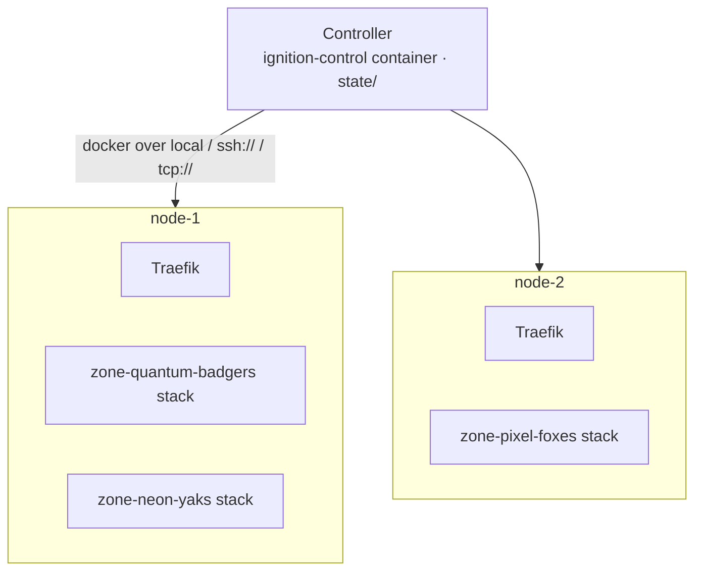
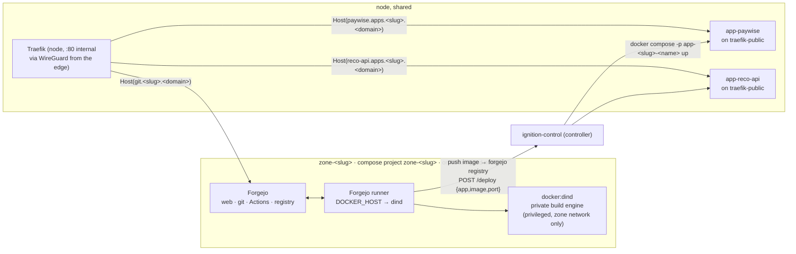
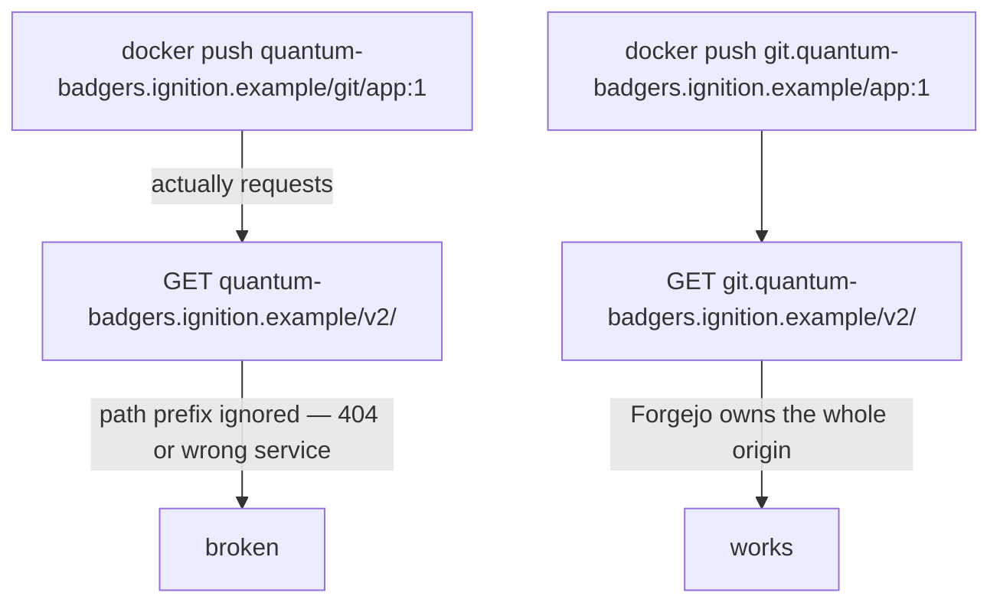
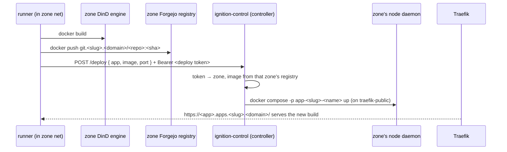

# Architecture

Ignition is **one Java (Spring Boot) service, `ignition-control`**, plus two
compose templates. It runs as a container on the **controller** — the only
machine with a public address and the only place TLS terminates — serves both
admin consoles, is the single front door for all traffic, and drives every
node's Docker daemon over the `docker` CLI. Nodes sit on a private network with
no inbound; the controller reaches them over WireGuard. State is a directory per
node, per team, and per app under `state/`. This page covers the domain scheme,
the shape of a team's stack, node placement, the control plane, ingress, and the
decisions that aren't obvious. Implementation detail is
in `DESIGN.md` and [`ignition-control/`](https://github.com/johnjoeallen/ignition/tree/main/ignition-control).

## The domain scheme

`BASE_DOMAIN` is the apex (`ignition.example` in these docs — a placeholder; use any
apex your org controls whose DNS serves names two labels deep). The **one
console** — every role, platform admin down to team member, what you see/do is
by role, not hostname — sits on the bare apex; each team owns the whole
`<slug>.ignition.example` subtree under it:

| host | serves |
|---|---|
| `ignition.example` | the console (`ignition-control`) — a team's own view is `/z?z=<slug>` on this same host |
| `git.<slug>.ignition.example` | that team's Forgejo — one origin for web UI, git, Actions, **and the container registry** |
| `<app>.apps.<slug>.ignition.example` | one deployed app; a team can run many, names unique within the team |

A forge needs a whole origin because Docker registry clients hit `/v2/…` at the
domain *root* and ignore path prefixes. Giving each team its own subtree keeps
git and every app on one clean per-team namespace. A single
pre-registered DNS wildcard `*.<BASE_DOMAIN>` → the controller resolves all of
it at any depth (RFC 4592), so provisioning a team adds no DNS. TLS wildcards,
which are single-label, are handled at the edge — see
[Ingress](#ingress-one-front-door).

## Nodes, teams, controller

- A **node** is `state/nodes/<name>.env`: a Docker endpoint (`local`,
  `ssh://user@host`, or `tcp://host:2376`), a stated `CPUS` / `MEM_GB`,
  optional `LABELS`, and a `STATE` (`active` / `draining`).
- A **team** is `state/zones/<slug>/`: `zone.env` (node, base domain,
  footprint, URLs), the rendered `docker-compose.yml`, `runner-secret`,
  `zone-admin.txt` (Forgejo admin login + API token — ignition-control's service
  credential, never handed to the team lead), `zone-token`,
  `deploy-token`, `last-activity`.
- An **app** is `state/zones/<slug>/apps/<name>.env`: which node it
  runs on, its image, port, and last deploy id — plus the rendered
  `<name>-compose.yml`.
- The **controller** runs `ignition-control` and never runs workloads
  itself — it drives each node's Docker daemon remotely.

The **scheduler** places a new team on the active node with the most free CPU
(capacity minus the sum of assigned teams' quota limits) that can fit it and
carries any required label. Quotas are limits not reservations, so nodes
oversubscribe — but a team whose limits alone exceed a node is never placed
there.

## A team's stack

The team stack is prefixed `zone-<slug>`; each app is its own project
`app-<slug>-<name>`. **Destroy** in the console tears down the stack **and
every app the team deployed**.

## The control plane

`ignition-control` is one container on the controller. It authenticates the caller's
bearer token and acts only within that scope:

| Token | Role | Can do |
|---|---|---|
| `IGN_ADMIN_TOKEN` | platform admin | every node, team, and app (platform view) |
| `state/zones/<slug>/zone-token` | team admin | that team only: Forgejo users, repos, cut releases, the team's apps, restart the runner, read status |
| `state/zones/<slug>/deploy-token` | CI | `POST /deploy` and `POST /undeploy` for that team's apps |

Team-admin actions are either a **proxied call to that team's Forgejo admin
API** (over the public `git.<slug>.<domain>`, using the token minted at
provisioning) or a `docker compose` command **scoped to a `zone-<slug>` or
`app-<slug>-<name>` project the team owns**. A team admin never gets node or Docker
access. See **[Roles](roles.md)**.

**App names are unique within a team.** An app is
`state/zones/<slug>/apps/<name>.env`. `ignition-control` only runs an image pulled
from the requesting team's own registry (`git.<slug>.<domain>/…`).

## Isolation boundaries

| Boundary | Enforced by |
|---|---|
| Team ↔ team (git, CI, builds) | Separate compose project, network, volumes; the DinD engine and runner are on the team network only, and the DinD engine never bind-mounts a host Docker socket. |
| CI jobs ↔ node | Jobs run against the team's **nested** Docker engine (`DOCKER_HOST=tcp://dind:2375`), which cannot see node containers or the node daemon. |
| Live app ↔ its own team's internals | The live app runs on `traefik-public`, not the team network — no path back into that team's forge or build engine. |
| Team admin ↔ platform | `ignition-control` never hands a team admin a node, a Docker endpoint, or another team's data — only proxied Forgejo calls and project-scoped `docker compose`. |
| CI ↔ deploy | `ignition-control` verifies the deploy token → team, and only runs an image from *that* team's own registry. |

The one seam: the app containers **and** the Forgejo instances share
`traefik-public` on a node, so they can reach each other by IP. The untrusted
code is the app container — "team A's app could probe team B's Forgejo or app"
is a real limitation. A Traefik-per-team network or an L3 policy would close it.

## Decision 1 — one subdomain subtree per team

Docker registry clients talk to `/v2/...` at the **domain root** and ignore
path prefixes. A forge at `<slug>.<domain>/git` would break `docker push`
against its own registry:

So each team's Forgejo owns `git.<slug>.<domain>` **entirely** — web UI,
git-over-HTTPS, the Actions API, and the registry. Apps sit alongside it under
the same subtree, `<app>.apps.<slug>.<domain>`, so a team runs as many as it
likes and each has a clean host. The console — for every role — is the one
`<domain>`; a team's own view is `<domain>/z?z=<slug>`.

## Decision 2 — apps are deployed from the controller

A container built and run *inside* the team's nested DinD engine is in that
engine's own network namespace. Traefik has no route to it.

So the flow splits: CI **builds** in the sandbox and **pushes** an image, then
POSTs `ignition-control`, which **runs** the container on the team's node, on
`traefik-public` where that node's Traefik can see it.

The workflow triggers **only on a release tag** — a plain push to `main` does
not deploy. Teams don't tag locally and don't use Forgejo's Releases form: the
**Release** button in the team console has ignition-control diff the last tag against
`main`, pick the semver bump from those commit messages (Conventional Commits;
the admin can override), and create the next `vX.Y.Z` tag on `main` through the
Forgejo API — so the tag is always made from reviewed, pushed history. Each run
pushes an immutable `:<sha>` **and** the `:<tag>` and deploys `:<tag>`.
`POST /deploy` is the immediate rollout; if CI later re-runs for the same tag
(a base-image rebuild), the per-node **Watchtower** (see below) picks up the
new digest without another deploy call. `ignition-control` stamps
`com.centurylinklabs.watchtower.enable=true` onto every app it deploys (the
label is in `app-compose.tmpl` — teams don't opt in); Watchtower manages only
those containers and never touches Traefik, Forgejo, DinD or runners.

Same shape as any CI-to-orchestrator handoff (GitLab CI → Kubernetes): the
build sandbox stays isolated, the serving layer does not.

## Decision 3 — no per-team host ports, one central control plane

Everything is routed by hostname — the controller's edge terminates it and, for
`git.<slug>.<domain>` and `<app>.apps.<slug>.<domain>`, forwards over WireGuard
to that node's internal Traefik, which does the final hop to Forgejo or the app;
the bare `<domain>` is served by `ignition-control` itself — the one console
for every role. Nothing binds a host port per team — no allocation table, no
range to exhaust.

And there is **one** `ignition-control`, not an agent per node. It already needs to
orchestrate across nodes (place a team, move a team, deploy an app to whichever
node its team is on), and it is the natural place to hold the platform token,
every team and deploy token, and every team's Forgejo admin token behind one
auth check. It runs as a container on the controller (socket + `state/` +
ssh keys mounted; on `traefik-public`) via
`templates/ignition-control-compose.yml`. Nodes run only Docker; all
decision-making is central.

## Runner registration is two-phase

Forgejo registers a runner against a **40-hex-character shared secret** we
generate ourselves — we even derive the runner's UUID from it locally (first 16
chars → bytes → hex → `8-4-4-4-12`). But the secret still has to be registered
*against Forgejo's database*, which only exists after first-run init. So
`ProvisioningService`:

1. `docker compose up -d forgejo dind` on the node — wait for Forgejo health.
2. `forgejo forgejo-cli actions register --secret <secret>` via `docker exec`.
3. Write `runner-config.yml` (URL + derived UUID + secret).
4. `docker compose up -d`, then `docker compose cp runner-config.yml
   runner:/data/config.yml` and restart the runner — `cp` rather than a bind
   mount, so it works whether the node is local or reached over SSH.

Real chicken-and-egg, not accidental complexity.

## Ingress — one front door

There is **one front door**: the controller is the only public machine and the
only place TLS terminates. Its edge Traefik owns `:443` (and `:80` for the ACME
challenge and the HTTPS redirect), runs the **SSO gateway** for browser
traffic, and reverse-proxies by `Host` over **WireGuard** to whichever node
runs the team. Nodes have **no inbound at all**; behind the edge everything is
**plain HTTP** — the WireGuard link is the confidentiality boundary.

**DNS** is a single pre-registered wildcard `*.<BASE_DOMAIN>` → the controller,
set up once and never touched. It matches at any depth (RFC 4592), so
`<BASE_DOMAIN>` itself, `git.<slug>.<BASE_DOMAIN>`, and
`<app>.apps.<slug>.<BASE_DOMAIN>` all resolve to the controller with no
per-team record.

**Certs** are all issued at the edge via the ACME DNS-01 challenge — one
`*.<BASE_DOMAIN>` (covering every single-label name) plus, per team,
`*.<slug>.<BASE_DOMAIN>` + `*.apps.<slug>.<BASE_DOMAIN>` (cert wildcards are
single-label, so these are two labels deep), which `ignition-control` requests
as it provisions the team, alongside its router snippet in
`state/control/dynamic/<slug>.yml`. CA is Let's Encrypt or a self-hosted
`step-ca` via `ACME_CA_SERVER`.

The **per-node Traefik** (`traefik-core-compose.yml`) stays, but
**internal-only** on `:80`: it watches `traefik-public` and does the final
`Host` → container hop for that node's Forgejo and apps. It holds no
certificates.

## Core services, once per node

`traefik-core-compose.yml` brings up two per-node services (on **every** node);
the controller additionally runs `ignition-control-compose.yml` with the edge
Traefik and SSO gateway.

**Watchtower** (`--label-enable`, 60s poll, `--cleanup --rolling-restart`)
rolls any container labelled `com.centurylinklabs.watchtower.enable=true`
forward when its image tag gets a new digest. `ignition-control` stamps that label on
every app it deploys (teams don't opt in) and nothing else carries it, so
Traefik, Forgejo, DinD and runners are never restarted. It reads
`${DOCKER_CONFIG_DIR:-/root/.docker}/config.json` for registry auth — the same
`docker login` a node needs for private packages.

**Traefik** (per node) watches `traefik-public` on `:80` only, reachable solely
over WireGuard from the controller. All TLS, all ACME, and all SSO live at the
controller's edge, described above.
