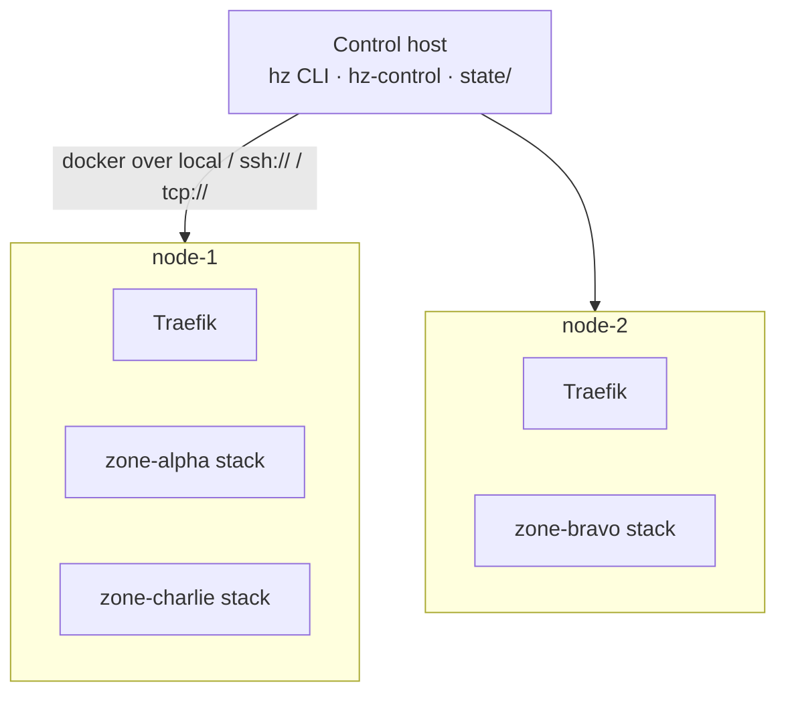
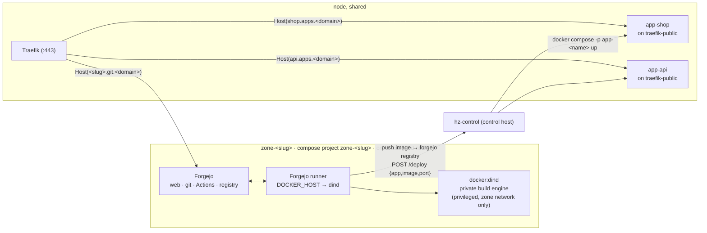
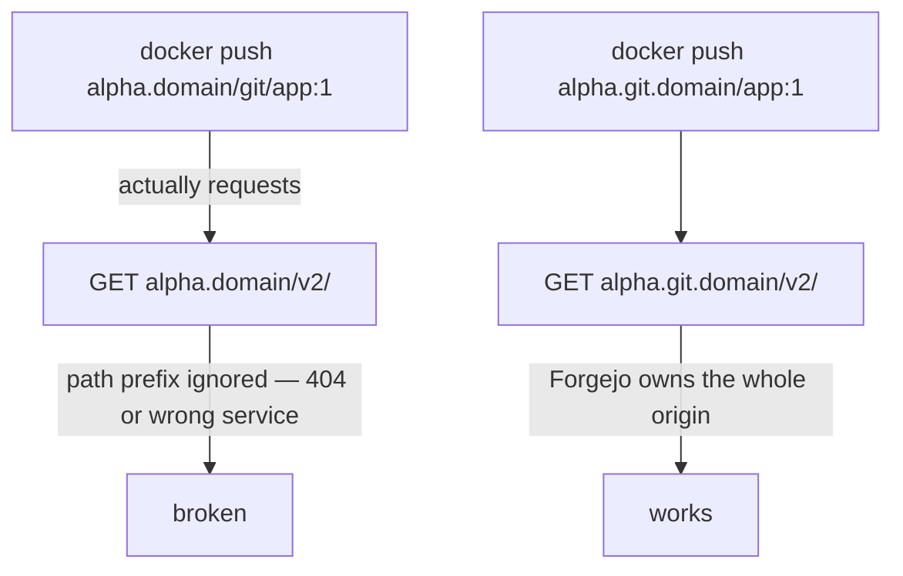

# Architecture

HackZone is compose templates, shell scripts (`hz`), and one small control
service. State is a directory per node, per zone, and per app under `state/`.
This page covers the domain scheme, the shape of a zone's stack, node
placement, the control plane, and the decisions that aren't obvious.

## The domain scheme

`BASE_DOMAIN` is the apex (`x.com`). Three segregated namespaces sit under it:

| host | serves |
|---|---|
| `admin.x.com` | the control plane (`hz-control`) |
| `<zone>.git.x.com` | that zone's Forgejo — one origin for web UI, git, Actions, **and the container registry** |
| `<app>.apps.x.com` | one deployed app; a zone can run many, names are global |

A forge needs a whole origin because Docker registry clients hit `/v2/…` at the
domain *root* and ignore path prefixes. Apps get their own namespace so a zone
isn't limited to one. `git` and `apps` are two labels deep, so a
`*.<BASE_DOMAIN>` wildcard misses them — see the TLS note under
[Traefik](#traefik-once-per-node).

## Nodes, zones, control host



- A **node** is `state/nodes/<name>.env`: a Docker endpoint (`local`,
  `ssh://user@host`, or `tcp://host:2376`), a stated `CPUS` / `MEM_GB`,
  optional `LABELS`, and a `STATE` (`active` / `draining`).
- A **zone** is `state/zones/<slug>/`: `zone.env` (node, base domain,
  footprint, URLs), the rendered `docker-compose.yml`, `runner-secret`,
  `zone-admin.txt` (Forgejo admin login + API token), `zone-token`,
  `deploy-token`, `last-activity`.
- An **app** is `state/apps/<name>.env`: which zone owns it, which node it
  runs on, its image, port, and last deploy id — plus the rendered
  `<name>-compose.yml`.
- The **control host** runs `hz` and `hz-control` and never runs workloads
  itself — it drives each node's Docker daemon remotely.

`scheduler.sh` places a new zone on the active node with the most free CPU
(capacity minus the sum of assigned zones' quota limits) that can fit it and
carries any `--label`. Quotas are limits not reservations, so nodes
oversubscribe — but a zone whose limits alone exceed a node is never placed
there.

## A zone's stack



The zone stack is prefixed `zone-<slug>`; each app is its own project
`app-<name>`. `hz zone destroy <slug>` tears down the stack **and every app the
zone deployed**.

## The control plane

`hz-control` is one process on the control host. It authenticates the caller's
bearer token and acts only within that scope:

| Token | Role | Can do |
|---|---|---|
| `HZ_ADMIN_TOKEN` | platform admin | every node, zone, and app (platform view) |
| `state/zones/<slug>/zone-token` | zone admin | that zone only: Forgejo users, repos, the zone's apps, restart the runner, read status |
| `state/zones/<slug>/deploy-token` | CI | `POST /deploy` and `POST /undeploy` for that zone's apps |

Zone-admin actions are either a **proxied call to that zone's Forgejo admin
API** (over the public `<slug>.git.<domain>`, using the token minted at
provisioning) or a `docker compose` command **scoped to a `zone-<slug>` or
`app-<name>` project the zone owns**. A zone admin never gets node or Docker
access. See **[Roles](roles.md)**.

**App names are global.** An app is `state/apps/<name>.env` recording its
owning zone. `hz-control` refuses a deploy of a name another zone owns, and
only runs an image pulled from the requesting zone's own registry
(`<slug>.git.<domain>/…`).

## Isolation boundaries

| Boundary | Enforced by |
|---|---|
| Zone ↔ zone (git, CI, builds) | Separate compose project, network, volumes; the DinD engine and runner are on the zone network only, and the DinD engine never bind-mounts a host Docker socket. |
| CI jobs ↔ node | Jobs run against the zone's **nested** Docker engine (`DOCKER_HOST=tcp://dind:2375`), which cannot see node containers or the node daemon. |
| Live app ↔ its own zone's internals | The live app runs on `traefik-public`, not the zone network — no path back into that zone's forge or build engine. |
| Zone admin ↔ platform | `hz-control` never hands a zone admin a node, a Docker endpoint, or another zone's data — only proxied Forgejo calls and project-scoped `docker compose`. |
| CI ↔ deploy | `hz-control` verifies the deploy token → zone, and only runs an image from *that* zone's own registry. |

The one seam: the app containers **and** the Forgejo instances share
`traefik-public` on a node, so they can reach each other by IP. The untrusted
code is the app container — "zone A's app could probe zone B's Forgejo or app"
is a real limitation. A Traefik-per-zone network or an L3 policy would close it.

## Decision 1 — a subdomain namespace each for git and apps

Docker registry clients talk to `/v2/...` at the **domain root** and ignore
path prefixes. A forge at `<slug>.<domain>/git` would break `docker push`
against its own registry:



So each zone's Forgejo owns `<slug>.git.<domain>` **entirely** — web UI,
git-over-HTTPS, the Actions API, and the registry. Apps get their own
namespace, `<app>.apps.<domain>`, so a zone runs as many as it likes and each
has a clean host. The control plane is `admin.<domain>`.

## Decision 2 — apps are deployed from the control host

A container built and run *inside* the zone's nested DinD engine is in that
engine's own network namespace. Traefik has no route to it.

So the flow splits: CI **builds** in the sandbox and **pushes** an image, then
POSTs `hz-control`, which **runs** the container on the zone's node, on
`traefik-public` where that node's Traefik can see it.

```mermaid
sequenceDiagram
    participant CI as runner (in zone net)
    participant DinD as zone DinD engine
    participant Reg as zone Forgejo registry
    participant Ctl as hz-control (control host)
    participant Node as zone's node daemon
    participant Traefik

    CI->>DinD: docker build
    CI->>Reg: docker push <slug>.git.<domain>/<repo>:<sha>
    CI->>Ctl: POST /deploy  { app, image, port }  + Bearer <deploy token>
    Ctl->>Ctl: token → zone; image from that zone's registry; app name free or already this zone's
    Ctl->>Node: docker compose -p app-<name> up  (on traefik-public)
    Traefik-->>CI: https://<app>.apps.<domain>/ serves the new build
```

Same shape as any CI-to-orchestrator handoff (GitLab CI → Kubernetes): the
build sandbox stays isolated, the serving layer does not.

## Decision 3 — no per-zone host ports, one central control plane

Everything is routed by hostname through each node's Traefik:
`<slug>.git.<domain>` → Forgejo, `<app>.apps.<domain>` → an app,
`admin.<domain>` → the control plane. Nothing binds a host port per zone — no
allocation table, no range to exhaust.

And there is **one** `hz-control`, not an agent per node. It already needs to
orchestrate across nodes (place a zone, move a zone, deploy an app to whichever
node its zone is on), and it is the natural place to hold the platform token,
every zone and deploy token, and every zone's Forgejo admin token behind one
auth check. Nodes run only Docker; all decision-making is central.

## Runner registration is two-phase

Forgejo registers a runner against a **40-hex-character shared secret** we
generate ourselves — we even derive the runner's UUID from it locally (first 16
chars → bytes → hex → `8-4-4-4-12`). But the secret still has to be registered
*against Forgejo's database*, which only exists after first-run init. So
`provision-zone.sh`:

1. `docker compose up -d forgejo dind` on the node — wait for Forgejo health.
2. `forgejo forgejo-cli actions register --secret <secret>` via `docker exec`.
3. Write `runner-config.yml` (URL + derived UUID + secret).
4. `docker compose up -d`, then `docker compose cp runner-config.yml
   runner:/data/config.yml` and restart the runner — `cp` rather than a bind
   mount, so it works whether the node is local or reached over SSH.

Real chicken-and-egg, not accidental complexity.

## Traefik, once per node

Each node runs one Traefik: owns `:80` / `:443`, watches `traefik-public`, and
holds **three** certificates via the ACME DNS challenge —
`admin.<event-domain>`, `*.git.<event-domain>`, `*.apps.<event-domain>`. Any
zone or app placed on that node is covered with no per-name request.

DNS is separate from certs: `<slug>.git.<event-domain>` and
`<app>.apps.<event-domain>` A-records must point at whichever node runs that
zone/app. On a single node, wildcard-A both namespaces; across nodes, a record
per zone/app (automating this via the DNS-provider API is the top next task).
