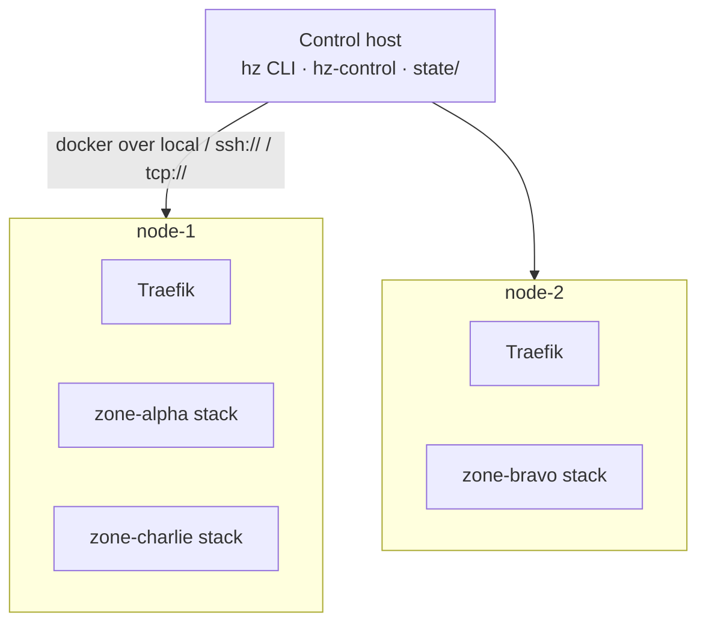
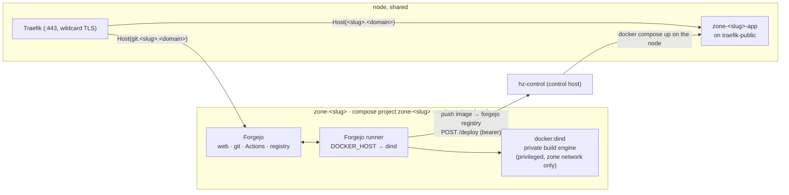

# Architecture

HackZone is compose templates, shell scripts (`hz`), and one small control
service. State is a directory per node and per zone under `state/`. This page
covers the shape of a zone's stack, how zones are placed on nodes, the control
plane, and the design decisions that aren't obvious.

## Nodes, zones, control host



- A **node** is `state/nodes/<name>.env`: a Docker endpoint (`local`,
  `ssh://user@host`, or `tcp://host:2376`), a stated `CPUS` / `MEM_GB`,
  optional `LABELS`, and a `STATE` (`active` / `draining`).
- A **zone** is `state/zones/<slug>/`: `zone.env` (its node, base domain,
  footprint, URLs), the rendered `docker-compose.yml`, `runner-secret`,
  `zone-admin.txt` (Forgejo admin login + API token), `zone-token` and
  `deploy-token`, `last-activity`.
- The **control host** runs `hz` and `hz-control` and never runs zone
  workloads itself — it drives each node's Docker daemon remotely.

`scheduler.sh` places a new zone on the active node with the most free CPU
(capacity minus the sum of assigned zones' quota limits) that can fit it and
carries any `--label`. Quotas are limits not reservations, so nodes
oversubscribe — but a zone whose limits alone exceed a node is never placed
there.

## A zone's stack



Everything in a zone is prefixed `zone-<slug>` — containers, networks,
volumes, and the compose project name — so
`docker compose -p zone-<slug> down -v` is a complete, safe teardown.

## The control plane

`hz-control` is one process on the control host. It authenticates the caller's
bearer token and acts only within that scope:

| Token | Role | Can do |
|---|---|---|
| `HZ_ADMIN_TOKEN` | platform admin | see every node and zone (platform view) |
| `state/zones/<slug>/zone-token` | zone admin | that zone only: add/remove Forgejo users, create repos, restart the runner, read status |
| `state/zones/<slug>/deploy-token` | CI | `POST /deploy` for that zone |

Zone-admin actions are either a **proxied call to that zone's Forgejo admin
API** (over the public `git.<slug>.<domain>`, using the token minted at
provisioning) or a `docker compose` command **scoped to that zone's project**
on its node. A zone admin never gets node or Docker access. See
**[Roles](roles.md)**.

## Isolation boundaries

| Boundary | Enforced by |
|---|---|
| Zone ↔ zone (git, CI, builds) | Separate compose project, network, volumes; the DinD engine and runner are on the zone network only, and the DinD engine never bind-mounts a host Docker socket. |
| CI jobs ↔ node | Jobs run against the zone's **nested** Docker engine (`DOCKER_HOST=tcp://dind:2375`), which cannot see node containers or the node daemon. |
| Live app ↔ its own zone's internals | The live app runs on `traefik-public`, not the zone network — no path back into that zone's forge or build engine. |
| Zone admin ↔ platform | `hz-control` never hands a zone admin a node, a Docker endpoint, or another zone's data — only proxied Forgejo calls and project-scoped `docker compose`. |
| CI ↔ deploy | `hz-control` verifies the deploy token → zone, and only runs an image from *that* zone's own registry. |

The one seam: the live-app containers **and** the Forgejo instances share
`traefik-public` on a node, so they can reach each other by IP. The untrusted
code is the app container — "zone A's app could probe zone B's Forgejo or app"
is a real limitation. A Traefik-per-zone network or an L3 policy would close it.

## Decision 1 — Forgejo gets its own subdomain, not a URL path

Docker registry clients always talk to `/v2/...` at the **domain root**. They
ignore path prefixes. If Forgejo's web UI lived at `<slug>.<domain>/git`, then
`docker push <slug>.<domain>/git/...` would still hit `/v2/` at the root and
silently fail.


So each zone's Forgejo owns `git.<slug>.<domain>` **entirely** — web UI,
git-over-HTTPS, the Actions API, and the container registry. Traefik terminates
TLS with a real certificate, so there is no raw host port and no
`insecure-registries` entry. The zone's root domain `<slug>.<domain>` is the
live app.

The trade-off is DNS/TLS scope: `*.<domain>` covers `<slug>.<domain>` but
**not** `git.<slug>.<domain>` (single-label wildcards). So each zone's Forgejo
router asks Traefik for a `*.<slug>.<domain>` cert, and `git.<slug>.<domain>`
needs a DNS record — a `*.<slug>.<domain>` record, or one added per zone.

## Decision 2 — the live app is deployed from the control host

A container built and run *inside* the zone's nested DinD engine is in that
engine's own network namespace. Traefik has no route to it.

So the flow splits: CI **builds** in the sandbox and **pushes** an image, then
POSTs `hz-control`, which **runs** the container on the zone's node, on
`traefik-public` where that node's Traefik can see it.

```mermaid
sequenceDiagram
    participant CI as runner (in zone net)
    participant DinD as zone DinD engine
    participant Reg as zone Forgejo registry
    participant Ctl as hz-control (control host)
    participant Node as zone's node daemon
    participant Traefik

    CI->>DinD: docker build
    CI->>Reg: docker push <image>
    CI->>Ctl: POST /deploy  { image, port }  + Bearer <deploy token>
    Ctl->>Ctl: verify token → zone; image must be from that zone's registry
    Ctl->>Node: docker compose up (image on traefik-public)
    Traefik-->>CI: https://<slug>.<domain>/ serves the new build
```

Same shape as any CI-to-orchestrator handoff (GitLab CI → Kubernetes): the
build sandbox stays isolated, the serving layer does not.

## Decision 3 — no per-zone host ports, one central control plane

Everything is routed by hostname through each node's Traefik:
`git.<slug>.<domain>` → Forgejo, `<slug>.<domain>` → the live app. Nothing
binds a host port per zone — no allocation table, no range to exhaust.

And there is **one** `hz-control`, not an agent per node. It already needs to
orchestrate across nodes (place a zone, move a zone, deploy to whichever node a
zone is on), and it is the natural place to hold the platform token, every
zone token, and every zone's Forgejo admin token behind one auth check. Nodes
run only Docker; all decision-making is central.

## Runner registration is two-phase

Forgejo registers a runner against a **40-hex-character shared secret** we
generate ourselves — we even derive the runner's UUID from it locally (first 16
chars → bytes → hex → `8-4-4-4-12`). But the secret still has to be registered
*against Forgejo's database*, which only exists after first-run init. So
`provision-zone.sh`:

1. `docker compose up -d forgejo dind` on the node — wait for Forgejo health.
2. `forgejo forgejo-cli actions register --secret <secret>` via `docker exec`.
3. Write `runner-config.yml` (URL + derived UUID + secret).
4. `docker compose up -d`, then `docker compose cp runner-config.yml
   runner:/data/config.yml` and restart the runner — `cp` rather than a bind
   mount, so it works whether the node is local or reached over SSH.

Real chicken-and-egg, not accidental complexity.

## Traefik, once per node

Each node runs one Traefik: owns `:80` / `:443`, holds a `*.<event-domain>`
wildcard (ACME DNS challenge), watches `traefik-public`. Every per-zone
hostname on that node goes through it — the live app at `<slug>.<domain>` on
the base wildcard, the Forgejo at `git.<slug>.<domain>` on a `*.<slug>.<domain>`
cert the zone's own router requests.
