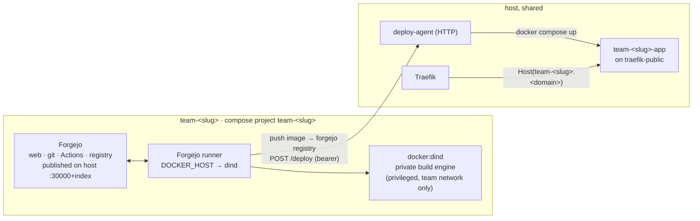
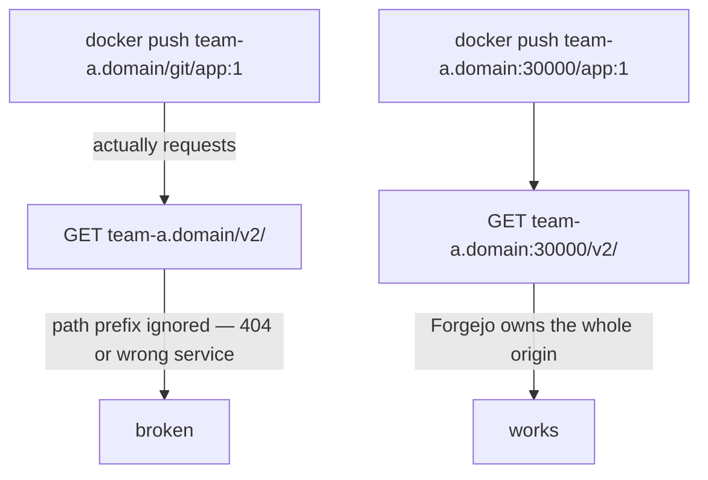

# Architecture

HackZone is compose templates plus shell scripts. There is no control plane —
provisioning is `envsubst` + `docker compose up`, and state is a directory per
team. This page covers the shape of a team's stack and the three design
decisions that aren't obvious.

## A team's stack



Everything in a team is prefixed `team-<slug>` — containers, networks, volumes,
and the compose project name — so `docker compose -p team-<slug> down -v` is a
complete, safe teardown.

## Isolation boundaries

| Boundary | Enforced by |
|---|---|
| Team ↔ team | Separate compose project, network, volumes; the DinD engine is on the team network only and never bind-mounts the host Docker socket. |
| CI jobs ↔ host | Jobs run against the team's **nested** Docker engine (`DOCKER_HOST=tcp://dind:2375`), which cannot see host containers or the host daemon. |
| Live app ↔ team internals | The live app runs on the host's `traefik-public` network, deployed by `deploy-agent` — it has no path back into the team's forge or build engine. |
| CI ↔ deploy | `deploy-agent` authenticates every call with a per-team bearer token and will only run an image pulled from *that* team's own registry. |

## Decision 1 — Forgejo owns a host port, not a URL path

Docker registry clients always talk to `/v2/...` at the **domain root**. They
ignore path prefixes. If Forgejo's web UI lived at `team-a.<domain>/git`, then
`docker push team-a.<domain>/git/...` would still hit `/v2/` at the root and
silently fail.



So each team's Forgejo owns `team-<slug>.<domain>:<port>` **entirely** — web UI,
git-over-HTTP, the Actions API, and the container registry, all on one origin.
The clean root domain on `:443` is reserved for the live app via Traefik.

## Decision 2 — the live app is deployed from the host

A container built and run *inside* the team's nested DinD engine lives in that
engine's own network namespace. Traefik, on the host, has no route to it.

So the flow splits: CI **builds** in the sandbox and **pushes** an image, then
hands off to `deploy-agent` on the host, which **runs** the container on the
shared `traefik-public` network where Traefik can see it.

```mermaid
sequenceDiagram
    participant CI as Forgejo runner (in team net)
    participant DinD as team DinD engine
    participant Reg as team Forgejo registry
    participant Agent as deploy-agent (host)
    participant Traefik

    CI->>DinD: docker build
    CI->>Reg: docker push <image>
    CI->>Agent: POST /deploy  { image, port }  + Bearer <team token>
    Agent->>Agent: verify token → team; verify image is from that team's registry
    Agent->>Traefik: docker compose up (image on traefik-public)
    Traefik-->>CI: https://<team>.<domain>/ now serves the new build
```

This is the same shape as any CI-to-orchestrator handoff (GitLab CI calling
Kubernetes, for example): the build sandbox stays isolated, the serving layer
does not.

## Decision 3 — ports are `30000 + team_index`

Port allocation is pure arithmetic. Re-running `provision-team.sh <slug>
<index>` for the same team is idempotent — same port, no drift, no allocation
table to keep in sync. `deploy-agent` derives everything it needs about a team
from `state/<slug>/team.env`, so the port math only lives in one place plus the
provisioning script.

## Runner registration is two-phase

Forgejo registers a runner against a **40-hex-character shared secret** that we
generate ourselves. We can even derive the runner's UUID from it locally (first
16 chars → raw bytes → hex → `8-4-4-4-12`). But the secret still has to be
registered *against Forgejo's database*, which only exists once Forgejo has done
its first-run init. So provisioning is:

1. `docker compose up -d forgejo dind` — wait for Forgejo health.
2. `forgejo forgejo-cli actions register --secret <secret>` via `docker exec`.
3. Write `state/<slug>/runner-config.yml` (URL + derived UUID + secret).
4. `docker compose up -d` — the runner starts and connects.

This chicken-and-egg is real, not accidental complexity — don't try to collapse
it into a single `up -d`.

## The host, once

Before any team: one Traefik instance owns `:80` and `:443`, holds a **wildcard
certificate** for `*.<event-domain>` (ACME DNS challenge), and watches the
`traefik-public` network. Per-team Forgejo instances do **not** go through
Traefik — they each own a dedicated host port.
