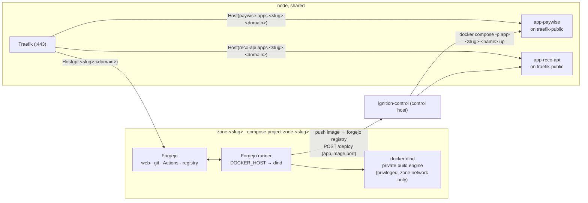
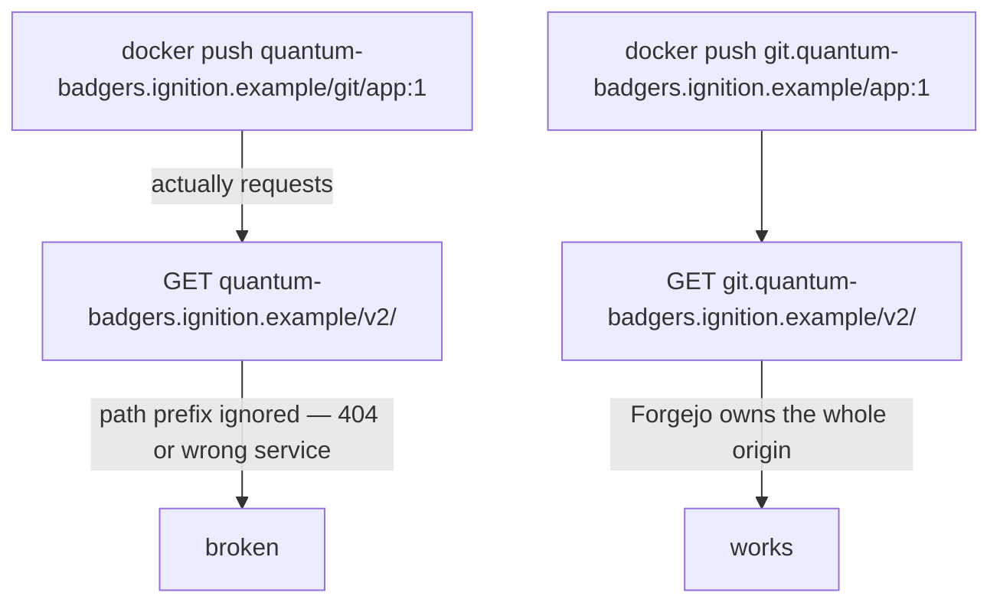

# Architecture

Ignition is **one Java (Spring Boot) service, `ignition-control`**, plus two
compose templates. It runs as a container on the control host, serves both
admin consoles, and drives every node's Docker daemon over the `docker` CLI.
State is a directory per node, per zone, and per app under `state/`. This page
covers the domain scheme, the shape of a zone's stack, node placement, the
control plane, and the decisions that aren't obvious. Implementation detail is
in `DESIGN.md` and [`ignition-control/`](https://github.com/johnjoeallen/ignition/tree/main/ignition-control).

## The domain scheme

`BASE_DOMAIN` is the apex (`ignition.example` in these docs — a placeholder; use any
apex your org controls whose DNS serves names two labels deep). The platform
admin sits on the apex; each zone owns the whole `<slug>.ignition.example` subtree
under it:

| host | serves |
|---|---|
| `admin.ignition.example` | the platform admin control plane (`ignition-control`) |
| `git.<slug>.ignition.example` | that zone's Forgejo — one origin for web UI, git, Actions, **and the container registry** |
| `admin.<slug>.ignition.example` | that zone's admin view (same `ignition-control`, zone-scoped) |
| `<app>.apps.<slug>.ignition.example` | one deployed app; a zone can run many, names unique within the zone |

A forge needs a whole origin because Docker registry clients hit `/v2/…` at the
domain *root* and ignore path prefixes. Giving each zone its own subtree keeps
git, admin, and every app on one clean per-zone namespace. Everything is two
labels deep, so a `*.<BASE_DOMAIN>` wildcard misses it — see the TLS note under
[Core services](#core-services-once-per-node).

## Nodes, zones, control host


- A **node** is `state/nodes/<name>.env`: a Docker endpoint (`local`,
  `ssh://user@host`, or `tcp://host:2376`), a stated `CPUS` / `MEM_GB`,
  optional `LABELS`, and a `STATE` (`active` / `draining`).
- A **zone** is `state/zones/<slug>/`: `zone.env` (node, base domain,
  footprint, URLs), the rendered `docker-compose.yml`, `runner-secret`,
  `zone-admin.txt` (Forgejo admin login + API token — ignition-control's service
  credential, never handed to the team lead), `zone-token`,
  `deploy-token`, `last-activity`.
- An **app** is `state/zones/<slug>/apps/<name>.env`: which node it
  runs on, its image, port, and last deploy id — plus the rendered
  `<name>-compose.yml`.
- The **control host** runs `ignition-control` and never runs workloads
  itself — it drives each node's Docker daemon remotely.

The **scheduler** places a new zone on the active node with the most free CPU
(capacity minus the sum of assigned zones' quota limits) that can fit it and
carries any required label. Quotas are limits not reservations, so nodes
oversubscribe — but a zone whose limits alone exceed a node is never placed
there.

## A zone's stack



The zone stack is prefixed `zone-<slug>`; each app is its own project
`app-<slug>-<name>`. **Destroy** in the console tears down the stack **and
every app the zone deployed**.

## The control plane

`ignition-control` is one container on the control host. It authenticates the caller's
bearer token and acts only within that scope:

| Token | Role | Can do |
|---|---|---|
| `IGN_ADMIN_TOKEN` | platform admin | every node, zone, and app (platform view) |
| `state/zones/<slug>/zone-token` | zone admin | that zone only: Forgejo users, repos, cut releases, the zone's apps, restart the runner, read status |
| `state/zones/<slug>/deploy-token` | CI | `POST /deploy` and `POST /undeploy` for that zone's apps |

Zone-admin actions are either a **proxied call to that zone's Forgejo admin
API** (over the public `git.<slug>.<domain>`, using the token minted at
provisioning) or a `docker compose` command **scoped to a `zone-<slug>` or
`app-<slug>-<name>` project the zone owns**. A zone admin never gets node or Docker
access. See **[Roles](roles.md)**.

**App names are unique within a zone.** An app is
`state/zones/<slug>/apps/<name>.env`. `ignition-control` only runs an image pulled
from the requesting zone's own registry (`git.<slug>.<domain>/…`).

## Isolation boundaries

| Boundary | Enforced by |
|---|---|
| Zone ↔ zone (git, CI, builds) | Separate compose project, network, volumes; the DinD engine and runner are on the zone network only, and the DinD engine never bind-mounts a host Docker socket. |
| CI jobs ↔ node | Jobs run against the zone's **nested** Docker engine (`DOCKER_HOST=tcp://dind:2375`), which cannot see node containers or the node daemon. |
| Live app ↔ its own zone's internals | The live app runs on `traefik-public`, not the zone network — no path back into that zone's forge or build engine. |
| Zone admin ↔ platform | `ignition-control` never hands a zone admin a node, a Docker endpoint, or another zone's data — only proxied Forgejo calls and project-scoped `docker compose`. |
| CI ↔ deploy | `ignition-control` verifies the deploy token → zone, and only runs an image from *that* zone's own registry. |

The one seam: the app containers **and** the Forgejo instances share
`traefik-public` on a node, so they can reach each other by IP. The untrusted
code is the app container — "zone A's app could probe zone B's Forgejo or app"
is a real limitation. A Traefik-per-zone network or an L3 policy would close it.

## Decision 1 — one subdomain subtree per zone

Docker registry clients talk to `/v2/...` at the **domain root** and ignore
path prefixes. A forge at `<slug>.<domain>/git` would break `docker push`
against its own registry:



So each zone's Forgejo owns `git.<slug>.<domain>` **entirely** — web UI,
git-over-HTTPS, the Actions API, and the registry. Apps sit alongside it under
the same subtree, `<app>.apps.<slug>.<domain>`, so a zone runs as many as it
likes and each has a clean host. The zone admin view is `admin.<slug>.<domain>`;
the platform control plane is `admin.<domain>`.

## Decision 2 — apps are deployed from the control host

A container built and run *inside* the zone's nested DinD engine is in that
engine's own network namespace. Traefik has no route to it.

So the flow splits: CI **builds** in the sandbox and **pushes** an image, then
POSTs `ignition-control`, which **runs** the container on the zone's node, on
`traefik-public` where that node's Traefik can see it.

```mermaid
sequenceDiagram
    participant CI as runner (in zone net)
    participant DinD as zone DinD engine
    participant Reg as zone Forgejo registry
    participant Ctl as ignition-control (control host)
    participant Node as zone's node daemon
    participant Traefik

    CI->>DinD: docker build
    CI->>Reg: docker push git.<slug>.<domain>/<repo>:<sha>
    CI->>Ctl: POST /deploy  { app, image, port }  + Bearer <deploy token>
    Ctl->>Ctl: token → zone; image from that zone's registry
    Ctl->>Node: docker compose -p app-<slug>-<name> up  (on traefik-public)
    Traefik-->>CI: https://<app>.apps.<slug>.<domain>/ serves the new build
```

The workflow triggers **only on a release tag** — a plain push to `main` does
not deploy. Teams don't tag locally and don't use Forgejo's Releases form: the
**Release** button in the zone console has ignition-control diff the last tag against
`main`, pick the semver bump from those commit messages (Conventional Commits;
the admin can override), and create the next `vX.Y.Z` tag on `main` through the
Forgejo API — so the tag is always made from reviewed, pushed history. Each run
pushes an immutable `:<sha>` **and** the `:<tag>` and deploys `:<tag>`.
`POST /deploy` is the immediate rollout; if CI later re-runs for the same tag
(a base-image rebuild), the per-node **Watchtower** (see below) picks up the
new digest without another deploy call. `ignition-control` stamps
`com.centurylinklabs.watchtower.enable=true` onto every app it deploys (the
label is in `app-compose.tmpl` — teams don't opt in); Watchtower manages only
those containers and never touches Traefik, Forgejo, DinD or runners.

Same shape as any CI-to-orchestrator handoff (GitLab CI → Kubernetes): the
build sandbox stays isolated, the serving layer does not.

## Decision 3 — no per-zone host ports, one central control plane

Everything is routed by hostname through each node's Traefik:
`git.<slug>.<domain>` → Forgejo, `<app>.apps.<slug>.<domain>` → an app,
`admin.<slug>.<domain>` → the zone view, `admin.<domain>` → the platform plane. Nothing binds a host port per zone — no
allocation table, no range to exhaust.

And there is **one** `ignition-control`, not an agent per node. It already needs to
orchestrate across nodes (place a zone, move a zone, deploy an app to whichever
node its zone is on), and it is the natural place to hold the platform token,
every zone and deploy token, and every zone's Forgejo admin token behind one
auth check. It runs as a container on the control host (socket + `state/` +
ssh keys mounted; on `traefik-public`) via
`templates/ignition-control-compose.yml`. Nodes run only Docker; all
decision-making is central.

## Runner registration is two-phase

Forgejo registers a runner against a **40-hex-character shared secret** we
generate ourselves — we even derive the runner's UUID from it locally (first 16
chars → bytes → hex → `8-4-4-4-12`). But the secret still has to be registered
*against Forgejo's database*, which only exists after first-run init. So
`ProvisioningService`:

1. `docker compose up -d forgejo dind` on the node — wait for Forgejo health.
2. `forgejo forgejo-cli actions register --secret <secret>` via `docker exec`.
3. Write `runner-config.yml` (URL + derived UUID + secret).
4. `docker compose up -d`, then `docker compose cp runner-config.yml
   runner:/data/config.yml` and restart the runner — `cp` rather than a bind
   mount, so it works whether the node is local or reached over SSH.

Real chicken-and-egg, not accidental complexity.

## Core services, once per node

`traefik-core-compose.yml` brings up two per-node services (on **every** node);
the control host additionally runs `ignition-control-compose.yml`.

**Watchtower** (`--label-enable`, 60s poll, `--cleanup --rolling-restart`)
rolls any container labelled `com.centurylinklabs.watchtower.enable=true`
forward when its image tag gets a new digest. `ignition-control` stamps that label on
every app it deploys (teams don't opt in) and nothing else carries it, so
Traefik, Forgejo, DinD and runners are never restarted. It reads
`${DOCKER_CONFIG_DIR:-/root/.docker}/config.json` for registry auth — the same
`docker login` a node needs for private packages.

**Traefik** owns `:80` / `:443`, watches `traefik-public`, and
holds certificates via the ACME DNS challenge. The control host's Traefik
holds the apex cert (`<event-domain>` + `*.<event-domain>`, covering
`admin.<event-domain>`); **each zone's own Forgejo router** additionally
requests `*.<slug>.<event-domain>` + `*.apps.<slug>.<event-domain>`, covering
that zone's git, admin, and every app with no per-name request.
`admin.<slug>.<event-domain>` is served by `ignition-control` behind the control
host's Traefik via a file-provider snippet
(`state/control/dynamic/<slug>.yml`).

DNS is separate from certs: `git.<slug>.<event-domain>` and
`*.apps.<slug>.<event-domain>` A-records must point at whichever node runs that
zone; `admin.<slug>.<event-domain>` and `admin.<event-domain>` at the control
host. On a single host, one `*.<slug>.<event-domain>` record per zone covers
it; across nodes, split git/apps from admin (automating this via the
DNS-provider API is the top next task).

!!! warning "Being replaced by single-ingress"
    The above is the current implementation. The design (**[Exposure &
    access](exposure.md)**) is one front door: **the controller is the only
    public machine and the only place TLS terminates**. It owns `:443`, runs
    the SSO gateway, and reverse-proxies by `Host` over **WireGuard** to nodes
    on a private network with **no inbound**. DNS is a single pre-registered
    wildcard `*.<BASE_DOMAIN>` → the controller; all certs are issued there;
    behind the edge everything is plain HTTP. The per-node Traefik stays,
    internal-only, for the final `Host` → container hop.
