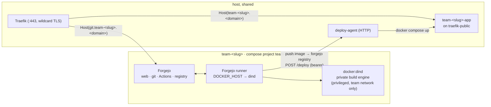
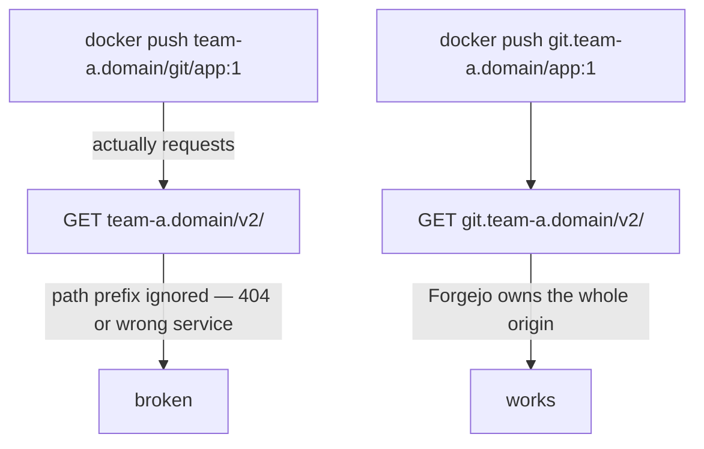

# Architecture

HackZone is compose templates plus shell scripts. There is no control plane —
provisioning is `envsubst` + `docker compose up`, and state is a directory per
team. This page covers the shape of a team's stack and the three design
decisions that aren't obvious.

## A team's stack



Everything in a team is prefixed `team-<slug>` — containers, networks, volumes,
and the compose project name — so `docker compose -p team-<slug> down -v` is a
complete, safe teardown.

## Isolation boundaries

| Boundary | Enforced by |
|---|---|
| Team ↔ team (git, CI, builds) | Separate compose project, network, volumes; the DinD engine and runner are on the team network only, and the DinD engine never bind-mounts the host Docker socket. |
| CI jobs ↔ host | Jobs run against the team's **nested** Docker engine (`DOCKER_HOST=tcp://dind:2375`), which cannot see host containers or the host daemon. |
| Live app ↔ its own team's internals | The live app runs on `traefik-public` (deployed by `deploy-agent`), not on the team network — it has no path back into that team's forge or build engine. |
| CI ↔ deploy | `deploy-agent` authenticates every call with a per-team bearer token and will only run an image from *that* team's own registry. |

The one seam: the live-app containers **and** the Forgejo instances all sit on
the shared `traefik-public` network, so they can reach each other by IP. The
untrusted code is the app container, so "team A's app could probe team B's
Forgejo or app" is a real limitation of this scaffold — a Traefik instance per
team, or an L3 policy on `traefik-public`, would close it.

## Decision 1 — Forgejo gets its own subdomain, not a URL path

Docker registry clients always talk to `/v2/...` at the **domain root**. They
ignore path prefixes. If Forgejo's web UI lived at `team-a.<domain>/git`, then
`docker push team-a.<domain>/git/...` would still hit `/v2/` at the root and
silently fail.



So each team's Forgejo owns `git.<slug>.<domain>` **entirely** — web UI,
git-over-HTTPS, the Actions API, and the container registry, all on one origin.
Traefik terminates TLS for it with a real certificate, so there is no raw host
port and the Docker daemon needs no `insecure-registries` entry. The team's
root domain `<slug>.<domain>` is reserved for the live app.

The trade-off is DNS/TLS scope. A `*.<domain>` wildcard covers `<slug>.<domain>`
but **not** `git.<slug>.<domain>` — DNS wildcards match a single label. So each
team's Forgejo router asks Traefik for a `*.<slug>.<domain>` cert (one per team,
via the ACME DNS challenge), and `git.<slug>.<domain>` needs a DNS record
pointing at the host — a `*.<slug>.<domain>` record, or one added per team.

## Decision 2 — the live app is deployed from the host

A container built and run *inside* the team's nested DinD engine lives in that
engine's own network namespace. Traefik, on the host, has no route to it.

So the flow splits: CI **builds** in the sandbox and **pushes** an image, then
hands off to `deploy-agent` on the host, which **runs** the container on the
shared `traefik-public` network where Traefik can see it.

```mermaid
sequenceDiagram
    participant CI as Forgejo runner (in team net)
    participant DinD as team DinD engine
    participant Reg as team Forgejo registry
    participant Agent as deploy-agent (host)
    participant Traefik

    CI->>DinD: docker build
    CI->>Reg: docker push <image>
    CI->>Agent: POST /deploy  { image, port }  + Bearer <team token>
    Agent->>Agent: verify token → team; verify image is from that team's registry
    Agent->>Traefik: docker compose up (image on traefik-public)
    Traefik-->>CI: https://<team>.<domain>/ now serves the new build
```

This is the same shape as any CI-to-orchestrator handoff (GitLab CI calling
Kubernetes, for example): the build sandbox stays isolated, the serving layer
does not.

## Decision 3 — no per-team host ports

Everything is routed by hostname through the one host-level Traefik:
`git.<slug>.<domain>` → the team's Forgejo, `<slug>.<domain>` → the team's live
app. Nothing binds a host port per team, so there is no allocation table to keep
in sync and no port-range to exhaust. `provision-team.sh` still accepts an
`<index>` argument, but it is only a stable roster ordinal recorded in
`state/<slug>/team.env` — it maps to nothing. (Earlier it was `30000 + index`.)

## Runner registration is two-phase

Forgejo registers a runner against a **40-hex-character shared secret** that we
generate ourselves. We can even derive the runner's UUID from it locally (first
16 chars → raw bytes → hex → `8-4-4-4-12`). But the secret still has to be
registered *against Forgejo's database*, which only exists once Forgejo has done
its first-run init. So provisioning is:

1. `docker compose up -d forgejo dind` — wait for Forgejo health.
2. `forgejo forgejo-cli actions register --secret <secret>` via `docker exec`.
3. Write `state/<slug>/runner-config.yml` (URL + derived UUID + secret).
4. `docker compose up -d` — the runner starts and connects.

This chicken-and-egg is real, not accidental complexity — don't try to collapse
it into a single `up -d`.

## The host, once

Before any team: one Traefik instance owns `:80` and `:443`, holds a **wildcard
certificate** for `*.<event-domain>` (ACME DNS challenge), and watches the
`traefik-public` network. Every per-team hostname goes through it — the live app
at `<slug>.<domain>` on the base wildcard, and the Forgejo at
`git.<slug>.<domain>` on a `*.<slug>.<domain>` cert the team's own router
requests.
