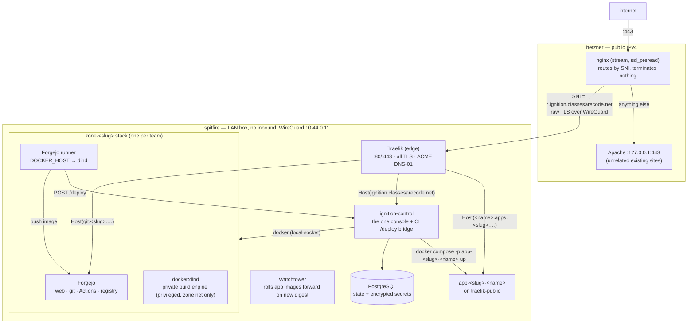
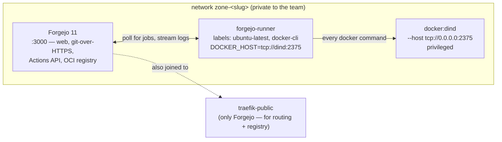

# End to end — from empty machines to a live app

This page is the whole story in one place: how the demo estate was built up
from nothing (**stage 1** on a LAN box, **stage 2** for public access), what
the running system actually looks like, and the **detailed flow** a change
takes from a `git push` to a live HTTPS URL — including the bugs that were in
the path the first time through and how each was fixed.

It complements the reference pages: [Architecture](architecture.md) describes
the *target* model, [Exposure & access](exposure.md) the ingress design,
[Roles](roles.md) the human/permission split. This page is the *as-built* demo
and the concrete request path.

The apex used throughout is `ignition.classesarecode.net`. Substitute your own
`BASE_DOMAIN`.

---

## 1. The journey

### Stage 1 — Ignition on one LAN box (`spitfire`)

**Goal:** the whole stack running and validated on a single machine behind NAT,
reachable only from the LAN. No public exposure.

`spitfire` is an ordinary box on a home/office LAN — no inbound from the
internet. It runs *everything*: the edge Traefik (TLS), `ignition-control` (the
control plane + web console), its PostgreSQL, and later every team's Forgejo,
build engine, runner and deployed apps.

```
     ┌──────────────────────────────┐
     │  spitfire        LAN only     │
     │  ── Traefik (edge) ──         │  owns :80/:443, all TLS via ACME DNS-01
     │  ── ignition-control ──       │  the one console (by role)
     │  ── postgres ──               │
     └──────────────────────────────┘
              ▲
              │  test from a laptop on the same LAN,
              │  via an /etc/hosts override → spitfire's LAN IP
```

The three things that made this work with **zero inbound**:

| Piece | Why it works behind NAT |
|---|---|
| **ACME DNS-01** | Let's Encrypt only ever *reads* DNS to verify a domain (a `TXT` at `_acme-challenge.…`). It never connects back. So `spitfire` gets real wildcard certificates (`ignition.classesarecode.net` + `*.ignition.classesarecode.net`) with nothing open. Only a DNS API credential is needed — no `A` record yet. |
| **Traefik as the single edge** | One process owns `:80`/`:443`, holds the certs, routes by hostname: bare apex → `ignition-control`; later `git.<slug>.…` → that team's Forgejo, `<app>.apps.<slug>.…` → that app. |
| **`/etc/hosts` on the test laptop** | The demo names resolve nowhere yet, so the tester adds one line: `<spitfire-LAN-IP> ignition.classesarecode.net`. |

First run bootstraps the platform admin: `ignition-control` logs a one-time
setup code, you open `/setup`, enter the code + email + password, and that
account is the `PLATFORM_ADMIN`. `/setup` then disappears.

`IGN_SECRET_KEY` (32 bytes, base64) encrypts every per-team credential in
Postgres. It must be kept and never changed. `IGN_USER_SECRET_PEPPER` (a UUID,
set once) is mixed into per-user git-credential encryption — also never changed.

At the end of stage 1: the platform console works from the LAN with a real
certificate; one node (`spitfire`, endpoint `local`) is registered. **The stack
configuration is final — stage 2 changes nothing on `spitfire`.**

!!! note "Full walkthrough"
    [`demo-1-spitfire.md`](https://github.com/johnjoeallen/ignition/blob/main/demo-1-spitfire.md)
    — every value explained, plus a generator (`demo/`) that renders all the
    config files.

### Stage 2 — public access through a box you already run (`hetzner`)

**Goal:** reach the demo from the internet **without a second IPv4 and without
IPv6**, through a root server that is *already* serving other sites on
`:80`/`:443` (Apache), plus mail and SSH — touching none of that.

The trick: dedicate the whole `ignition.classesarecode.net` domain to the demo,
and split traffic on `hetzner` purely by **TLS SNI** — the hostname in the
`ClientHello`, visible without decrypting anything.

```
                    internet  →  <hetzner public IPv4>:443
                                       │
                     ┌─────────────────▼─────────────────┐
                     │  hetzner :  nginx  (stream, ssl_preread)  │
                     └──────┬────────────────────────┬────┘
   SNI matches             │                        │      SNI = anything else
   *.ignition.classesarecode.net                    │
   or the bare apex        │                        ▼
   (raw TLS, WireGuard)    │                Apache 127.0.0.1:443
                           ▼                (existing sites — unchanged, loopback)
              spitfire  10.44.0.11:443
              (stage 1, unchanged — terminates its own TLS end to end)
```

| Component | Role |
|---|---|
| **nginx `stream` + `ssl_preread`** | Reads the SNI, forwards the **raw** TLS stream — never terminates it. `spitfire` still presents its own Let's Encrypt cert end to end; Apache still presents its own for its own domains. |
| **WireGuard** | One encrypted link, `hetzner 10.44.0.1` ↔ `spitfire 10.44.0.11`. `spitfire` **dials out** to `hetzner:51820`, so the home router needs no config. `hetzner` can then reach `spitfire` even though `spitfire` accepts nothing inbound. |
| **Apache → loopback** | `Listen 443` → `Listen 127.0.0.1:443` (one line). `<VirtualHost *:443>` blocks still match; no vhost edits. `:80` stays entirely with Apache, so its certbot HTTP-01 renewals keep working. |
| **One DNS wildcard** | `*.ignition.classesarecode.net A <hetzner IP>` (+ optional bare apex). Covers every depth — the apex, `git.<slug>.…`, `x.apps.<slug>.…` — so provisioning a team adds **no DNS**. |

Gotchas hit and recorded in the stage-2 guide:

- Debian's `nginx` has no `stream` module built in — `apt install libnginx-mod-stream`.
- The SNI map needs **both** a bare-apex line *and* a `~\.domain$` regex — the
  regex requires a literal dot before the match, which the apex doesn't have, so
  the apex silently falls through to Apache without its own line.
- Apache must be **restarted**, not gracefully reloaded, for the `Listen`
  address change — a reload left the old socket half-alive, the new process
  couldn't bind, systemd `SIGKILL`'d it, Apache ended up fully down.
- nginx's stock `sites-enabled/default` binds `:80` and conflicts with Apache —
  `rm` it or nginx won't start at all.
- A new team's hostname needs a manual `/etc/hosts` entry on any LAN client that
  was used in stage 1 testing (or just remove the stage-1 override so the public
  path is used) — otherwise a stale entry sends it to the wrong place and it
  looks like a 503.

At the end of stage 2: every `*.ignition.classesarecode.net` name resolves
publicly and routes `client → nginx (SNI) → WireGuard → spitfire Traefik →
service`. Apache's sites are untouched.

!!! note "Full walkthrough"
    [`demo-2-remote-access.md`](https://github.com/johnjoeallen/ignition/blob/main/demo-2-remote-access.md)
    — WireGuard configs, the nginx stream block, the Apache change, firewall,
    PROXY-protocol for real client IPs, and an alternative using a second IP.

### Stage 3 — the first real deployment (and the bugs in the path)

Provisioning a team and creating an app worked immediately. Getting a **release
to actually build, push and deploy** surfaced five separate defects — every one
of them on the path between "click Release" and "app is live". They are fixed as
of **v0.112.2**; existing app repos need their workflow file refreshed (see
[below](#repairing-an-app-made-before-v01122)).

| # | Symptom in the Actions run | Cause | Fix | Version |
|---|---|---|---|---|
| 1 | `exec: "node": executable file not found` (exit 126), job dies before step 1 | `runs-on: docker-cli` → `code.forgejo.org/oci/docker:cli`, a bare Alpine + Docker CLI with **no Node.js**; `actions/checkout@v4` is a JavaScript action | first step `apk add --no-cache nodejs` (Alpine ships Node 24, past checkout's floor) | v0.111.4 |
| 2 | `docker login` → `registry-1.docker.io … unauthorized` (wrong registry entirely) | `ZoneService.setVar` used **`PUT`** on the Forgejo variables API — which only *updates*; a `PUT` to a missing name 404s. So `REGISTRY`/`CONTROL_URL`/`APP_NAME`/`APP_PORT` were **never set**, and `docker login ""` fell through to Docker Hub | `POST` to create, `PUT` on 409 | v0.111.4 |
| 3 | `curl: not found` in the Deploy step, after a clean build | the job image has no `curl` either (it has `wget`) | fold `curl` into the same first `apk add` | v0.111.5 |
| 4 | `unauthorized: reqPackageAccess` on `docker push` to the zone registry | Forgejo's container registry **rejects the per-run Actions token** (`github.token`) for package writes, regardless of the job's `permissions:` block — it needs a real user token with `write:package` | **Create app** now also seeds `FORGEJO_TOKEN` (the zone bot's PAT) + `REGISTRY_USER` (the bot username); the workflow does `docker login -u ${{ vars.REGISTRY_USER }}` | v0.112.1 |
| 5 | Deploy step: `curl … /deploy` → **502** ×4, exit 22 | `POST /deploy` reached `ignition-control`, which ran `docker compose up --pull always` on the node — but the app image is a **private** package and **the node had no registry credentials** (a documented-but-manual `docker login` on the node) | `AppService.deploy` now runs `docker login git.<slug>.<domain>` (zone bot token) on the node before the compose up; Watchtower reads the same `~/.docker/config.json` | v0.112.2 |

Two supporting changes came out of the same work:

- **`createApp` is idempotent** (v0.112.1): running "Create app" against a name
  that already exists re-applies every variable, secret and starter file
  instead of failing on the 409. So a fix to what's seeded reaches old apps —
  "Create app" doubles as "repair this app's deploy config".
- **The `/deploy` path now logs** (v0.112.2): request, success, and the compose
  `stderr` on failure. It had *no* logging before, which is why bug 5's 502 was
  invisible in `docker logs ignition-control`.
- **Delete an app** (v0.112.0): the team console could only *stop* a running
  app, never remove its repo. There's now a **delete** button (stops the
  deployment, then deletes the Forgejo repo) so a broken app can be recreated
  under the same name.

After v0.112.2 the pipeline runs clean: `apk add nodejs curl` → `checkout` →
`docker login` (bot PAT) → `docker build` → `docker push` (both tags) →
`POST /deploy` → `ignition-control` logs the node into the registry →
`compose up --pull` → Traefik serves the new image.

---

## 2. Architecture as deployed (the demo topology)

The [Architecture](architecture.md) page describes the *target* model, where a
separate public **controller** runs the edge Traefik + an SSO gateway and each
node's Traefik is internal-only. The demo collapses that: **`spitfire` is both
the controller and the only node**, and `hetzner` is a dumb SNI shuttle.

### The machines



- `ignition-control`, Traefik, Postgres and Watchtower come from the two compose
  templates (`traefik-core-compose.yml`, `ignition-control-compose.yml`).
- Each **team** ("zone" in the code) is one compose project, `zone-<slug>`,
  brought up by `ProvisioningService` on the node.
- Each **app** is its own project, `app-<slug>-<name>`, on the shared
  `traefik-public` network so the node's Traefik can route to it.
- `ignition-control` drives Docker over the **local socket** here (endpoint
  `local`); in a multi-node estate it's `ssh://` or `tcp://` per node.

### A team's stack (`zone-<slug>`)



| Container | Purpose | Network |
|---|---|---|
| **Forgejo** | Git host, pull requests, Actions, **and the container registry** — one origin, `git.<slug>.<domain>` | `zone-<slug>` **and** `traefik-public` |
| **docker:dind** | The team's private build engine. Privileged, but reachable only from the zone network; never bind-mounts a host socket | `zone-<slug>` only |
| **forgejo-runner** | Picks up Actions jobs, runs each job step in a container **inside DinD** (`network: host` = the DinD namespace, which is on the zone net) | `zone-<slug>` only |

Runner registration is two-phase (chicken-and-egg): bring up Forgejo + DinD,
wait healthy, `forgejo-cli actions register --secret <secret>` (the secret is
generated locally, and the runner UUID is derived from its first 16 bytes),
write `runner-config.yml`, bring up the runner, `compose cp` the config into its
volume, restart it. Provisioning also creates the `ignition-bot` Forgejo admin
account and mints its all-scopes token — stored encrypted as the zone's
`forgejo_token` secret, and never handed to the team.

### The domain & TLS scheme

| Host | Serves | Cert (all ACME DNS-01, at the edge) |
|---|---|---|
| `ignition.classesarecode.net` | the console (`ignition-control`); a team's view is `/teams/<slug>` on this same host | `ignition.classesarecode.net` + `*.ignition.classesarecode.net` (one wildcard, requested at startup) |
| `git.<slug>.ignition.classesarecode.net` | that team's Forgejo — web, git, Actions, registry | per team: `*.<slug>.ignition.classesarecode.net` + `*.apps.<slug>.ignition.classesarecode.net` (two labels deep, so the apex wildcard misses them; `ignition-control` requests this as it provisions the team) |
| `<name>.apps.<slug>.ignition.classesarecode.net` | one deployed app | covered by the team's `*.apps.<slug>.…` SAN above |

A forge needs a **whole origin** because Docker registry clients hit `/v2/…` at
the domain root and ignore path prefixes — `<slug>.<domain>/git` would break
`docker push` against its own registry. One subtree per team keeps git and every
app on a clean per-team namespace, and one pre-registered DNS wildcard resolves
all of it at any depth.

### Isolation boundaries

| Boundary | Enforced by |
|---|---|
| Team ↔ team (git, CI, builds) | Separate compose project, network, volumes. DinD + runner are on the zone network only; DinD never mounts a host socket. |
| CI job ↔ node | Job steps run against the team's **nested** engine (`DOCKER_HOST=tcp://dind:2375`) — no view of node containers or the node daemon. |
| Live app ↔ its own team's internals | The app runs on `traefik-public`, not the zone network — no path back to that team's Forgejo or build engine. |
| CI ↔ deploy | `POST /deploy` resolves the bearer to a slug; `ignition-control` will only run an image whose ref starts with *that* team's registry (`git.<slug>.<domain>/`). |
| Team admin ↔ platform | `ignition-control` only ever does a proxied Forgejo API call or a `docker compose` scoped to a `zone-<slug>` / `app-<slug>-<name>` project. No node, socket, or other team's data. |

The one seam: on the demo, app containers and every team's Forgejo share the
flat `traefik-public` network on `spitfire`, so they can reach each other by IP.
The untrusted code is the app container. Don't run untrusted app code in the
demo; a Traefik-per-team network or an L3 policy closes it.

---

## 3. Detailed flow

### 3.1 Provisioning a team

Console → **Teams → New team** → a slug (e.g. `temporal-dragons`).

```mermaid
sequenceDiagram
    autonumber
    participant Admin
    participant Ctl as ignition-control
    participant Node as spitfire Docker
    participant FJ as zone Forgejo
    participant Edge as edge Traefik

    Admin->>Ctl: POST /teams  { slug }
    Ctl->>Ctl: scheduler picks the node with most free CPU that fits
    Ctl->>Edge: write the team's Traefik router snippet<br/>(cert SANs *.&lt;slug&gt; + *.apps.&lt;slug&gt;)
    Edge-->>Edge: ACME DNS-01 → obtains the per-team cert
    Ctl->>Node: docker compose -p zone-&lt;slug&gt; up -d forgejo dind
    Ctl->>FJ: await /api/healthz healthy
    Ctl->>FJ: forgejo-cli actions register --secret (20-byte hex)
    Ctl->>Node: compose up -d (runner) ; compose cp runner-config.yml ; restart runner
    Ctl->>FJ: create ignition-bot admin ; mint all-scopes token
    Ctl->>Ctl: encrypt & store zone secrets:<br/>runner-secret, forgejo_token, zone-token, deploy-token
    Ctl-->>Admin: team ready (~1–2 min) — you are its admin
```

State written (all in Postgres, secrets encrypted with `IGN_SECRET_KEY`):
`zone` row (node, base domain, git host, apps base), `zone_secret` rows
(`runner-secret`, `forgejo_username`/`_password`/`_url`/`_token`, `zone-token`,
`deploy-token`).

### 3.2 Creating an app

Team console → **Apps → Create app** → name + description. An app **is** its
repo.

```mermaid
sequenceDiagram
    autonumber
    participant Dev
    participant Ctl as ignition-control
    participant FJ as zone Forgejo

    Dev->>Ctl: POST /teams/&lt;slug&gt;/apps  { name, description }
    Ctl->>FJ: POST /orgs/&lt;slug&gt;/repos  (private, auto_init)
    Ctl->>FJ: seed .forgejo/workflows/deploy.yml, Dockerfile, nginx.conf, index.html
    Ctl->>FJ: POST actions/variables  REGISTRY, CONTROL_URL, APP_NAME, APP_PORT, REGISTRY_USER
    Ctl->>FJ: PUT  actions/secrets  DEPLOY_TOKEN, FORGEJO_TOKEN
    Ctl->>FJ: enable branch protection on main (no direct push — PRs only)
    Ctl-->>Dev: "clone it, push, then Release"
```

Seeded into the repo:

| Repo setting | Value | Used by |
|---|---|---|
| var `REGISTRY` | `git.<slug>.<domain>` | image ref prefix; `docker login` host |
| var `REGISTRY_USER` | `ignition-bot` | `docker login -u` (must match the token owner) |
| var `CONTROL_URL` | `ignition-control`'s public URL | the Deploy step's `POST …/deploy` |
| var `APP_NAME` | `<name>` | deploy payload; final URL |
| var `APP_PORT` | `8080` | fixed — the app listens on 8080 / `$PORT` |
| secret `DEPLOY_TOKEN` | the zone's `deploy-token` | bearer for `POST /deploy` |
| secret `FORGEJO_TOKEN` | the zone bot's PAT (`write:package`) | `docker login` / `docker push` to the registry |

Because `createApp` is idempotent (v0.112.1), re-running **Create app** with an
existing name re-applies all of the above — the repair path for old apps.

### 3.3 Cutting a release

Teams do **not** tag locally and do **not** use Forgejo's Releases form. Day to
day: open an issue (its branch is created automatically), push to that branch,
open a PR from the issue row, merge (closes the issue, deletes the branch).
Then, from the app's management page:

**Release** → `ReleaseService.cut(slug, owner, repo, kind)`:

1. `GET /repos/<slug>/<repo>/tags?limit=50` → the latest `vX.Y.Z`.
2. If `kind == auto`, read the commit messages since that tag and classify by
   [Conventional Commits](https://www.conventionalcommits.org/): `feat:` →
   **minor**, `feat!:` / `BREAKING CHANGE:` → **major**, anything else →
   **patch**. The dropdown next to **Release** overrides this for one release.
3. `POST /repos/<slug>/<repo>/tags` with `tag_name = vX.Y.Z`,
   `target_commitish = main` — the tag is created on Forgejo, always from
   reviewed, already-pushed history.

`main` is branch-protected, so there is no way to push a tag from a laptop; the
only way an app deploys is this button.

### 3.4 Build → push → deploy → live

The new tag matches `on: push: tags: ["*"]` in the seeded
`.forgejo/workflows/deploy.yml` and the runner picks up the job.

```mermaid
sequenceDiagram
    autonumber
    participant Run as runner (job in DinD, network=host)
    participant DinD as zone DinD engine
    participant Reg as zone Forgejo registry<br/>git.&lt;slug&gt;.&lt;domain&gt;
    participant Ctl as ignition-control
    participant Node as spitfire Docker
    participant Edge as edge Traefik

    Note over Run: job image = code.forgejo.org/oci/docker:cli (bare Alpine + docker CLI)
    Run->>Run: apk add --no-cache nodejs curl
    Run->>Reg: actions/checkout@v4  (needs node)
    Run->>Reg: docker login -u ignition-bot  (FORGEJO_TOKEN, write:package)
    Run->>DinD: docker build -t $REPO:$SHA -t $REPO:$TAG .
    Run->>Reg: docker push $REPO:$SHA  then  docker push $REPO:$TAG
    Run->>Ctl: POST $CONTROL_URL/deploy  { app, image: $REPO:$TAG, port }<br/>Authorization: Bearer $DEPLOY_TOKEN
    Ctl->>Ctl: DeployTokenFilter: bearer → slug (constant-time match)
    Ctl->>Ctl: reject unless image starts with git.&lt;slug&gt;.&lt;domain&gt;/
    Ctl->>Node: docker login git.&lt;slug&gt;.&lt;domain&gt; -u ignition-bot (zone forgejo_token)
    Ctl->>Node: docker compose -p app-&lt;slug&gt;-&lt;name&gt; up -d --pull always --remove-orphans
    Node->>Reg: pull $REPO:$TAG   (now authenticated)
    Node-->>Ctl: container up, labelled traefik.* + watchtower.enable=true
    Ctl-->>Run: 200 { ok, url: https://&lt;name&gt;.apps.&lt;slug&gt;.&lt;domain&gt;/ }
    Edge-->>Edge: sees the new container on traefik-public, routes it by Host
```

Key rules enforced along the way:

- **Only a tag deploys.** A plain push to `main` runs nothing (and `main` is
  protected anyway).
- **Two image tags every run:** immutable `:<sha>` and the moving `:<release
  tag>`. `/deploy` rolls out `:<tag>`.
- **`/deploy` is team-scoped.** The bearer is the zone's `deploy-token`;
  `DeployTokenFilter` matches it (constant-time) against every zone's secret to
  resolve the slug, and `AppService.deploy` refuses any image ref not under that
  zone's own registry.
- **The app compose** (`app-compose.tmpl`) stamps
  `com.centurylinklabs.watchtower.enable=true`, the Traefik router/rule/port
  labels, `PORT=8080`, and CPU/memory limits. No host port is published.

### 3.5 Rollout and roll-forward

`POST /deploy` is the **immediate** rollout — `compose up` pulls and (re)starts
the container now.

For a later re-push to the **same** tag (a base-image rebuild, a re-run of CI),
there's no second `/deploy` call. The per-node **Watchtower** (`--label-enable`,
60 s poll) notices the new digest for that tag and rolls the container forward
on its own, using the credentials in `/root/.docker/config.json` — the same file
`ignition-control` wrote with its pre-deploy `docker login`. Watchtower only
ever touches containers carrying the enable label, so Traefik, Forgejo, DinD and
runners are never restarted.

### 3.6 What a browser request traverses

```
you ──HTTPS──▶ hetzner :443
                 nginx stream, ssl_preread reads SNI:
                   *.ignition.classesarecode.net  ─┐   (raw TLS, not decrypted)
                                                   ▼
                              WireGuard  hetzner 10.44.0.1 ──▶ spitfire 10.44.0.11
                                                   │
                                             spitfire edge Traefik  :443
                                             terminates TLS, routes by Host:
                     ┌───────────────────────────┼───────────────────────────┐
                     ▼                           ▼                           ▼
        ignition.classesarecode.net   git.<slug>.…              <name>.apps.<slug>.…
          → ignition-control            → zone Forgejo             → app container
```

Everything behind the edge is plain HTTP on `traefik-public`; the WireGuard link
is the confidentiality boundary. `spitfire` sees every request from
`10.44.0.1` (the tunnel) unless PROXY protocol is enabled.

---

## 4. Repairing an app made before v0.112.2

Existing app repos still carry the old workflow file and are missing the newer
repo settings. Two options:

=== "Recreate (clean)"

    1. Roll `ignition-control` forward: `cd ~/git/ignition && git pull && ./update-and-run.sh`
    2. Team console → the app's row → **delete** (stops any deployment, deletes
       the repo).
    3. **Create app** again with the same name — fresh workflow + all vars/secrets.

=== "Repair in place"

    1. Roll `ignition-control` forward (as above).
    2. Team console → **Create app** with the **same name** — `createApp` is
       idempotent and re-seeds `.forgejo/workflows/deploy.yml` plus every
       variable and secret.
    3. Cut a new **Release**.

If a deploy still fails after that, the `/deploy` path now logs — check
`docker logs ignition-control` for `deploy <slug>/<app>: …` lines to see whether
it was the node login, the image pull, or a request that never arrived (which
would point back at the edge / SNI path).

---

## 5. How the demo differs from the target model

| | this demo | [target model](exposure.md) |
|---|---|---|
| TLS terminates on | `spitfire` | the public controller |
| `hetzner` runs | nginx SNI passthrough only | edge Traefik + SSO gateway + `ignition-control` |
| control plane | on the only node | on a separate controller |
| node Traefik | is the edge (holds `:443` behind the SNI proxy) | internal-only `:80`, edge routes by `Host` over WireGuard |
| authentication | the consoles only; apps + Forgejo UIs are open | one `forward-auth` SSO gateway in front of everything |
| compose templates | unchanged | the remaining edge/SSO wiring |

Moving to the target model reuses everything here — same DNS record, same
certificates, same teams.
