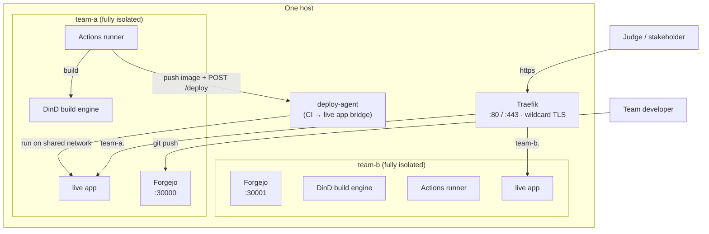

# HackZone

**Per-team infrastructure for hackathons and innovation sprints.** Up to ~80
teams on one host. Each team gets a fully isolated stack that stands up in
seconds and tears down without residue.

  <a class="hz-button" href="executive-overview.md">Executive Overview</a>
  <a class="hz-button hz-button-secondary" href="architecture.md">Architecture</a>
  <a class="hz-button hz-button-secondary" href="https://github.com/johnjoeallen/hackzone-one">GitHub</a>

## What each team gets

- **A forge** — git hosting, pull requests, issues, CI/CD (Actions), and a
  container registry, all from one [Forgejo](https://forgejo.org/) instance on
  a dedicated port.
- **A private build sandbox** — a per-team Docker-in-Docker engine, so one
  team's CI can never see another team's images, containers, or network.
- **A live, shareable demo** — reachable at `https://<team>.<event-domain>/`,
  deployed by the team's own CI on every push to `main`.

## How a team's stack works

1. A developer pushes to their Forgejo repo.
2. A **Forgejo Actions** workflow runs on the team's runner. The job builds a
   container image inside the team's **private DinD engine** — isolated from
   every other team.
3. The workflow pushes the image to the team's own Forgejo container registry,
   then calls **`deploy-agent`** (running on the host) with a per-team bearer
   token.
4. `deploy-agent` runs that image on the shared, Traefik-watched network. Within
   seconds `https://<team>.<event-domain>/` serves the new build.

## Why it's built this way

The design makes a few choices that look odd until you hit the constraint
behind them — the forge gets a whole host port rather than a URL path, the live
app is deployed from the host rather than from inside the sandbox, ports are
pure arithmetic. See **[Architecture](architecture.md)** for each one, and
**[Executive Overview](executive-overview.md)** for why infrastructure like this
is the thing that decides whether an innovation event produces working software
or just slides.

## Status

A working scaffold: the templates, provisioning/teardown scripts, the idle
sweeper, and the deploy agent are all in place and validate. A short list of
rough edges (TLS on the forge ports, automatic repo seeding, registry
credentials for the agent) is tracked in the repo's `README` and `CLAUDE.md`.
