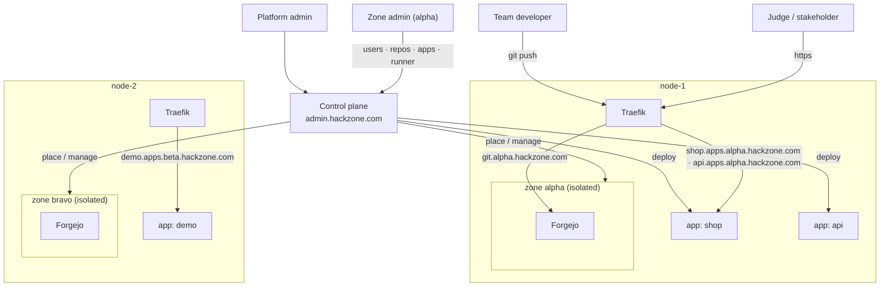

# HackZone

**Per-team infrastructure for hackathons and innovation sprints.** Many teams
(target ~80) across a small pool of hosts. Each team gets a fully isolated
stack — a **zone** — that stands up in seconds and tears down without residue.

  <a class="hz-button" href="executive-overview.md">Executive Overview</a>
  <a class="hz-button hz-button-secondary" href="roles.md">Roles</a>
  <a class="hz-button hz-button-secondary" href="architecture.md">Architecture</a>
  <a class="hz-button hz-button-secondary" href="https://github.com/johnjoeallen/hackzone-one">GitHub</a>

## The domain scheme

`hackzone.com` is the apex where hackzone is hosted. Everything else is a segregated
subdomain:

!!! note
    `hackzone.com` is a placeholder. `BASE_DOMAIN` can be any apex your
    organisation controls — the only requirement is DNS that can serve names
    two labels deep and wildcard certificates for `*.<slug>.<apex>`.

| host | what |
|---|---|
| `admin.hackzone.com` | the platform control plane |
| `admin.<zone>.hackzone.com` | that zone's admin view |
| `git.<zone>.hackzone.com` | that zone's Forgejo — git, PRs, Actions, registry |
| `<app>.apps.<zone>.hackzone.com` | a deployed app (a zone can run many; names unique within the zone) |

## What each team gets

- **A forge** — git, PRs, issues, CI/CD, and a container registry, all from one
  [Forgejo](https://forgejo.org/) at `https://git.<team>.hackzone.com/`.
- **A private build sandbox** — a per-zone Docker-in-Docker engine, so one
  zone's CI can never see another zone's images, containers, or network.
- **Live, shareable apps** — each repo with the deploy workflow puts an app at
  `https://<app-name>.apps.<team>.hackzone.com/`. Builds start when the zone
  admin **cuts a release** in the web UI (or on a push to `main`), and every
  deployed app is wired with a Watchtower agent automatically, so a re-pushed
  image also rolls out on its own — nothing to configure in the repo.
- **A zone admin** — the team lead adds members, creates repos, cuts releases,
  manages the zone's apps, and restarts the runner, without a platform ticket.

## How a zone's apps get deployed

1. A developer pushes to a Forgejo repo that has the deploy workflow.
2. A **Forgejo Actions** job builds a container image inside the zone's
   **private DinD engine** — isolated from every other zone.
3. It pushes the image to the zone's own registry (`git.<zone>.hackzone.com/…`), then
   POSTs the **control plane** `{app, image, port}` with the zone's deploy
   token.
4. The control plane checks the app name (global; first zone to use it owns
   it) and runs the image on the zone's node, on the Traefik-watched network.
   Within seconds `https://<app>.apps.<zone>.hackzone.com/` serves the new build.

## Why it's built this way

A few choices look odd until you hit the constraint behind them — git and apps
each get their own subdomain namespace rather than a URL path, apps are
deployed from the control host rather than from inside the sandbox, there are
no per-zone host ports, and one central control plane holds every credential
rather than an agent per node. See **[Architecture](architecture.md)** for
each, **[Roles](roles.md)** for the platform-admin / zone-admin split, and
**[Executive Overview](executive-overview.md)** for why infrastructure like
this decides whether an innovation event produces working software or slides.

## Status

A working scaffold: the `hz` CLI (`node`, `zone`, `app`, scheduler), zone
provisioning/teardown (two-phase, mints the zone-admin account and tokens), the
idle sweeper, and the control plane (platform view, zone-admin surface, CI
`/deploy` + `/undeploy`) are all in place and validate. Rough edges — the
`<slug>.git` / `<app>.apps` DNS records, repo seeding, hardening the control
plane — are tracked in `README` and `CLAUDE.md`.
