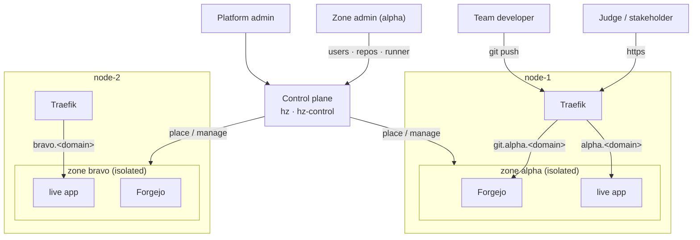

# HackZone

**Per-team infrastructure for hackathons and innovation sprints.** Many teams
(target ~80) across a small pool of hosts. Each team gets a fully isolated
stack — a **zone** — that stands up in seconds and tears down without residue.

  <a class="hz-button" href="executive-overview.md">Executive Overview</a>
  <a class="hz-button hz-button-secondary" href="roles.md">Roles</a>
  <a class="hz-button hz-button-secondary" href="architecture.md">Architecture</a>
  <a class="hz-button hz-button-secondary" href="https://github.com/johnjoeallen/hackzone-one">GitHub</a>

## What each team gets

- **A forge** — git hosting, pull requests, issues, CI/CD (Actions), and a
  container registry, all from one [Forgejo](https://forgejo.org/) instance at
  `https://git.<team>.<event-domain>/`.
- **A private build sandbox** — a per-zone Docker-in-Docker engine, so one
  zone's CI can never see another zone's images, containers, or network.
- **A live, shareable demo** — reachable at `https://<team>.<event-domain>/`,
  deployed by the team's own CI on every push to `main`.
- **A zone admin** — the team lead can add members, create repos, and restart
  the runner for their zone, without a platform ticket.

## How a zone's stack works

1. A developer pushes to their Forgejo repo.
2. A **Forgejo Actions** workflow runs on the zone's runner. The job builds a
   container image inside the zone's **private DinD engine** — isolated from
   every other zone.
3. The workflow pushes the image to the zone's own Forgejo container registry,
   then POSTs the **control plane** (per-zone bearer token).
4. The control plane runs that image on the zone's node, on the Traefik-watched
   network. Within seconds `https://<team>.<event-domain>/` serves the new build.

## Why it's built this way

A few choices look odd until you hit the constraint behind them — the forge
gets its own subdomain rather than a URL path, the live app is deployed from
the control host rather than from inside the sandbox, there are no per-zone
host ports, and one central control plane holds every credential rather than an
agent per node. See **[Architecture](architecture.md)** for each,
**[Roles](roles.md)** for the platform-admin / zone-admin split, and
**[Executive Overview](executive-overview.md)** for why infrastructure like
this decides whether an innovation event produces working software or slides.

## Status

A working scaffold: the `hz` CLI (nodes, zones, scheduler), the zone
provisioning/teardown (two-phase, mints the zone-admin account and tokens), the
idle sweeper, and the control plane (platform view, zone-admin surface, CI
`/deploy` bridge) are all in place and validate. Rough edges — the
`git.<slug>` DNS record, repo seeding, hardening the control plane — are
tracked in `README` and `CLAUDE.md`.
