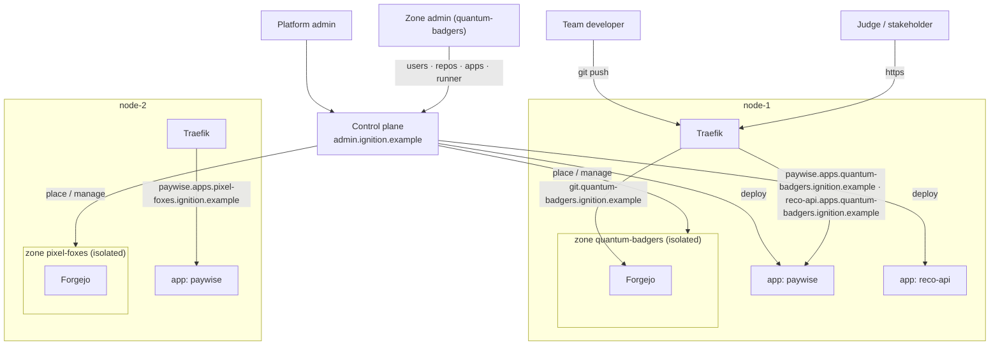

# Ignition

**Per-team infrastructure for hackathons and innovation sprints.** Many teams
(target ~80) across a small pool of hosts. Each team gets a fully isolated
stack — a **zone**: its own git host, CI, container registry, private build
engine, and a routed HTTPS origin for whatever it deploys. A zone stands up in
seconds from one command and tears down in one more, leaving nothing behind.

The point isn't just to satisfy a security review (though it does that too — see
[Why a zone per team](#why-a-zone-per-team)). Even on infrastructure with no
restrictions at all, giving each team its own disposable stack is simply the
model that produces the most working software per event: it removes the
coordination tax of shared environments, contains the failures that hackathon
code inevitably causes, and makes every team's output a real running URL instead
of a laptop demo.

  <a class="ign-button" href="executive-overview.md">Executive Overview</a>
  <a class="ign-button ign-button-secondary" href="roles.md">Roles</a>
  <a class="ign-button ign-button-secondary" href="architecture.md">Architecture</a>
  <a class="ign-button ign-button-secondary" href="https://github.com/johnjoeallen/ignition">GitHub</a>

## The domain scheme

`ignition.example` is the apex where ignition is hosted. Everything else is a segregated
subdomain:

!!! note
    `ignition.example` is a placeholder. `BASE_DOMAIN` can be any apex your
    organisation controls — the only requirement is DNS that can serve names
    two labels deep and wildcard certificates for `*.<slug>.<apex>`.

| host | what |
|---|---|
| `admin.ignition.example` | the platform control plane |
| `admin.<zone>.ignition.example` | that zone's admin view |
| `git.<zone>.ignition.example` | that zone's Forgejo — git, PRs, Actions, registry |
| `<app>.apps.<zone>.ignition.example` | a deployed app (a zone can run many; names unique within the zone) |

## What each team gets

- **A forge** — git, PRs, issues, CI/CD, and a container registry, all from one
  [Forgejo](https://forgejo.org/) at `https://git.<team>.ignition.example/`.
- **A private build sandbox** — a per-zone Docker-in-Docker engine, so one
  zone's CI can never see another zone's images, containers, or network.
- **Live, shareable apps** — each repo with the deploy workflow puts an app at
  `https://<app-name>.apps.<team>.ignition.example/`. Builds start when the zone
  admin hits **Release** in the zone console — a plain push to `main` does not
  deploy. Every deployed app is also wired with a Watchtower agent
  automatically, so if an image is re-pushed to a tag it rolls out on its own
  — nothing to configure in the repo.
- **A zone admin** — the team lead adds members, creates repos, ships releases,
  manages the zone's apps, and restarts the runner, without a platform ticket.

## How a zone's apps get deployed

1. The zone admin hits **Release** in the zone console — ign-control reads the
   commits since the last release, picks the version bump from them
   (Conventional Commits; override available) and tags the next `vX.Y.Z` on
   `main`. That release tag is the only thing that deploys — a plain push to
   `main` does not. See
   [Roles → Shipping a release](roles.md#shipping-a-release).
2. A **Forgejo Actions** job builds a container image inside the zone's
   **private DinD engine** — isolated from every other zone.
3. It pushes the image to the zone's own registry (`git.<zone>.ignition.example/…`),
   then POSTs the **control plane** `{app, image, port}` with the zone's deploy
   token.
4. The control plane checks the image came from that zone's registry and runs
   it on the zone's node, on the Traefik-watched network, with a Watchtower
   label added automatically. Within seconds
   `https://<app>.apps.<zone>.ignition.example/` serves the new build — and any
   later re-push of that tag rolls out on its own (~60s), no workflow rerun.
   App names are unique within a zone, not global.

## Why a zone per team

Assume the friendliest possible environment: root on every box, no security
team to convince, unlimited budget. A zone per team is *still* the right call.

- **Failure isolation.** Hackathon code is code no one has run before —
  half-written migrations, an accidental fork bomb in a Dockerfile, a process
  that eats all the RAM, a CI job that never exits. In a zone that's one team's
  problem for two minutes. On a shared host it's everyone's problem, and the
  recovery is "who has root and what did they just change." Isolation turns a
  shared incident into a private one.
- **No coordination tax.** Teams on shared infrastructure spend real time
  negotiating: ports, base-image versions, "can I restart the box", "why is CI
  slow", "who's on the GPU". Each of those is a synchronous interruption to
  someone else's flow. A zone has one tenant — there is nothing to negotiate.
- **An identical, clean start.** Every zone is rendered from the same
  templates, so every team begins from the same known-good baseline: no "works
  because I installed something last week", no cruft inherited from the last
  event. A team that wedges its setup gets a fresh zone in seconds instead of
  spelunking shared state.
- **Fidelity.** A real routed HTTPS origin, a real registry, real CI — the
  shape of production, not a localhost approximation. Ideas that survive that
  are ideas that could actually ship, and the demo *is* the artifact you hand
  to a product team.
- **Fair, predictable capacity.** Per-zone CPU/memory quotas mean one team's
  build storm can't starve everyone else's pipeline. The platform team sizes
  for concurrency, not for the worst-behaved tenant.
- **Teardown that's actually finished.** Everything a zone touches is namespaced
  to it, so one command removes all of it, verifiably. No leaked volumes, no
  "is this still needed?" six months later, no slow spend creep — and that's a
  reliability and trust problem before it's ever a cost one.
- **It matches the shape of the work.** A sprint is bursty and short-lived.
  Standing up permanent per-team infrastructure is overkill; a shared permanent
  box accumulates every problem above. Spin up Monday, gone Friday, keep the
  scripts.

And where the environment *does* impose limits — no root Docker on shared hosts
for unvetted participants, audit or network-policy requirements — the same
design is what makes a "yes" possible at all. That's a bonus, not the reason.

## How it's built

A few choices look odd until you hit the constraint behind them — each zone
gets its own subdomain subtree rather than a URL path, apps are deployed from
the control host rather than from inside the sandbox, there are no per-zone
host ports, and one central control plane holds every credential rather than an
agent per node. See **[Architecture](architecture.md)** for
each, **[Roles](roles.md)** for the platform-admin / zone-admin split, and
**[Executive Overview](executive-overview.md)** for the business case.

## Status

A working scaffold: the `ign` CLI (`node`, `zone`, `app`, scheduler), zone
provisioning/teardown (two-phase, mints the zone-admin account and tokens), the
idle sweeper, and the control plane (platform view, zone-admin surface, CI
`/deploy` + `/undeploy`) are all in place and validate. Rough edges — the
per-zone (`git.<slug>` / `*.apps.<slug>` / `admin.<slug>`) DNS records, repo
seeding, hardening the control plane — are tracked in `README` and `CLAUDE.md`.

**In progress:** the shell CLI and the Python control plane are being replaced
by a single Java (Spring Boot) service, deployed as a container, with **every**
platform-admin and zone-admin operation in the web UI — no CLI. The model
(zones, the domain scheme, roles, release-driven deploys) is unchanged; see
`DESIGN.md` in the repo.
