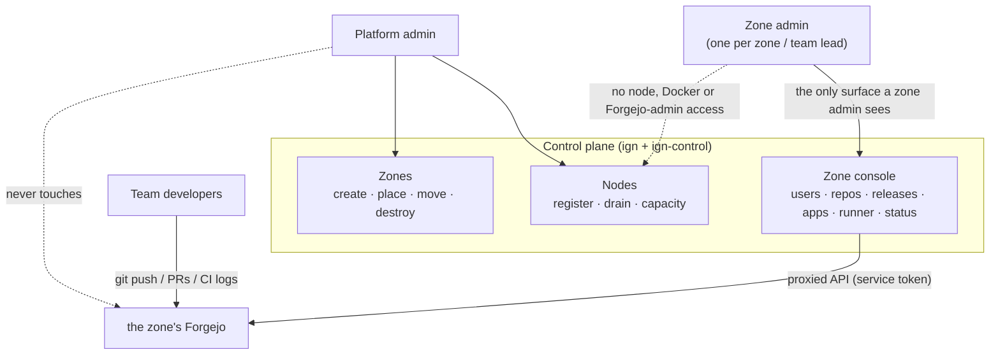

# Roles

Ignition has two admin roles and a clean line between them.

## Platform admin

The person (or two) running the event. Holds `IGN_ADMIN_TOKEN`. Works through
the **`ign` CLI** and the control plane's **platform view** today; the
[in-progress rewrite](architecture.md) moves every command below into the
platform console so there is no CLI.

| Task | How |
|---|---|
| Register a host to run zones | `ign node add <name> <docker-host> --cpus N --mem NNg [--labels …]` |
| See node capacity / allocation | `ign node list`, `ign node show <name>` |
| Stop placing new zones on a node | `ign node drain <name>` (then `undrain`) |
| Create a zone (auto-placed) | `ign zone create <slug>` — the scheduler picks the least-loaded node that fits |
| Create a zone on a specific node | `ign zone create <slug> --node <name>` |
| See every zone and its live status | `ign zone list`, `ign zone status <slug>`, or the platform view |
| Move a zone to another node | `ign zone move <slug> --node <name>` (the stack is rebuilt; data volumes don't follow) |
| Destroy a zone | `ign zone destroy <slug>` — the stack **and every app it deployed**, complete |
| See / stop any deployed app | `ign app list`, `ign app show <zone> <name>`, `ign app rm <zone> <name>` |
| Reclaim idle zones | `ign sweep` / a cron on `scripts/sweep-idle.sh` |

The platform admin **never logs into a zone's Forgejo**. Their surface is
nodes and zones.

## Zone admin

One per zone — the team lead. At provisioning time they get **one** credential:
a **zone token** (`state/zones/<slug>/zone-token`) which signs them in at
`https://admin.<slug>.<event-domain>/` — the **zone console**.

That console is their whole surface. They never touch a Forgejo admin screen;
the `zoneadmin` Forgejo account exists only as ign-control's service credential
and stays on the control host. Everything below is a console action:

| Task | In the console |
|---|---|
| Add / remove team members | **Users** — creates the Forgejo account for them |
| Create repositories | **Repositories → Create repo** |
| Ship a build | **Repositories → Release** — version is picked from commits since the last release (override available); see below |
| Manage the zone's apps | **Apps** — list, live status, remove. Deploys come from CI; every app is wired with a Watchtower agent automatically, so a re-pushed image redeploys on its own (~60s). |
| Restart a stuck Actions runner | **Restart runner** button |
| See build / deploy status, the live-app URL | status card |

Every console action is either a **proxied call to that zone's Forgejo admin
API** (with the service token, never exposed) or a `docker compose` command
**scoped to a `zone-<slug>` or `app-<slug>-<name>` project the zone owns**. A
zone admin has no node access, no Docker access, no Forgejo admin access, and
no visibility into any other zone.

Developers on the team use the git remote for code, pull requests and CI logs
like any forge — that's the *developer* surface, separate from this one.

### Shipping a release

Release versioning is automated — **no one bumps the version**. In the console
under **Repositories**, each repo shows its current version (e.g. `· v1.2.3`).
Click **Release** and ign-control:

1. reads the commit messages **since the last release** (it compares the last
   tag to `main`),
2. picks the bump from them by [Conventional Commits](https://www.conventionalcommits.org/):
   a `fix:` → **patch**, a `feat:` → **minor**, a `feat!:` or `BREAKING CHANGE:`
   → **major** (nothing conventional → patch),
3. tags the next `vX.Y.Z` on `main` (first release `v0.1.0`, or `v1.0.0` for a
   major).

The dropdown next to **Release** defaults to *auto (from commits)*; switch it to
`patch` / `minor` / `major` to override for that one release.

The new tag fires the `build and deploy` workflow; on success the app is live
at `https://<APP_NAME>.apps.<slug>.<event-domain>/` within a minute or two.
**Only a release deploys** — a plain push to `main` does not — so every running
image carries a version you can redeploy or roll back to.

Re-pushing an image to the **same** tag later (a base-image rebuild, say) needs
no new release: the per-node Watchtower notices the new digest and rolls the
app forward on its own within ~60s.

## The line between them

- Platform admin: *which* hosts exist, *where* zones run, *whether* a zone
  exists at all.
- Zone admin: *what happens inside* one zone — people, repos, the runner, and
  shipping releases — all from the zone console, never a Forgejo admin screen.

The control plane (`ign-control`) is the single process that holds both sets of
credentials and enforces the split: it authenticates the caller's token,
decides platform-vs-zone, and only ever acts within that scope.
