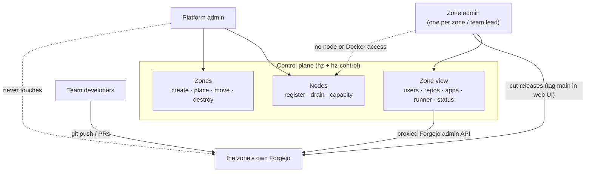

# Roles

HackZone has two admin roles and a clean line between them.

## Platform admin

The person (or two) running the event. Holds `HZ_ADMIN_TOKEN`. Works through
the **`hz` CLI** and the control plane's **platform view**.

| Task | How |
|---|---|
| Register a host to run zones | `hz node add <name> <docker-host> --cpus N --mem NNg [--labels …]` |
| See node capacity / allocation | `hz node list`, `hz node show <name>` |
| Stop placing new zones on a node | `hz node drain <name>` (then `undrain`) |
| Create a zone (auto-placed) | `hz zone create <slug>` — the scheduler picks the least-loaded node that fits |
| Create a zone on a specific node | `hz zone create <slug> --node <name>` |
| See every zone and its live status | `hz zone list`, `hz zone status <slug>`, or the platform view |
| Move a zone to another node | `hz zone move <slug> --node <name>` (the stack is rebuilt; data volumes don't follow) |
| Destroy a zone | `hz zone destroy <slug>` — the stack **and every app it deployed**, complete |
| See / stop any deployed app | `hz app list`, `hz app show <zone> <name>`, `hz app rm <zone> <name>` |
| Reclaim idle zones | `hz sweep` / a cron on `scripts/sweep-idle.sh` |

The platform admin **never logs into a zone's Forgejo**. Their surface is
nodes and zones.

## Zone admin

One per zone — the team lead. Gets, at provisioning time:

- a **Forgejo admin login** (`state/zones/<slug>/zone-admin.txt`) for that
  zone's Forgejo, and
- a **zone control token** (`state/zones/<slug>/zone-token`) — they sign in
  with it at `https://admin.<slug>.<event-domain>/` to get the zone view.

Through the zone view (or Forgejo directly) they manage **their zone only**:

| Task | Where |
|---|---|
| Add / remove team members | zone view "Users", or Forgejo → Site Administration → Users |
| Create repositories | zone view "Repositories", or Forgejo → New Repository |
| Ship a build | **Cut a release** — zone view "Repositories" → *cut a release →*, or Forgejo → Releases → New release, target `main`. Tagging off reviewed, pushed history (never `git push --tags` from a laptop) is what starts a build; it runs the same workflow as a push to `main`. |
| Manage the zone's apps | zone view "Apps" — list, live status, remove. Deploys come from CI; every app also gets a Watchtower agent wired in automatically, so a re-pushed image redeploys on its own (~60s). |
| Restart a stuck Actions runner | zone view button (`docker compose -p zone-<slug> restart runner`) |
| See build / deploy status, the live-app URL | zone view status card |
| Manage PRs, issues, Actions, packages | Forgejo, as normal |

Every zone-view action is either a **proxied call to that zone's own Forgejo
admin API** (with the token minted at provisioning) or a `docker compose`
command **scoped to a `zone-<slug>` or `app-<slug>-<name>` project the zone owns**. A
zone admin has no node access, no Docker access, and no visibility into any
other zone.

## The line between them

- Platform admin: *which* hosts exist, *where* zones run, *whether* a zone
  exists at all.
- Zone admin: *what happens inside* one zone — people, repos, the runner, and
  cutting releases (tagging `main` in the web UI to ship a build).

The control plane (`hz-control`) is the single process that holds both sets of
credentials and enforces the split: it authenticates the caller's token,
decides platform-vs-zone, and only ever acts within that scope.
