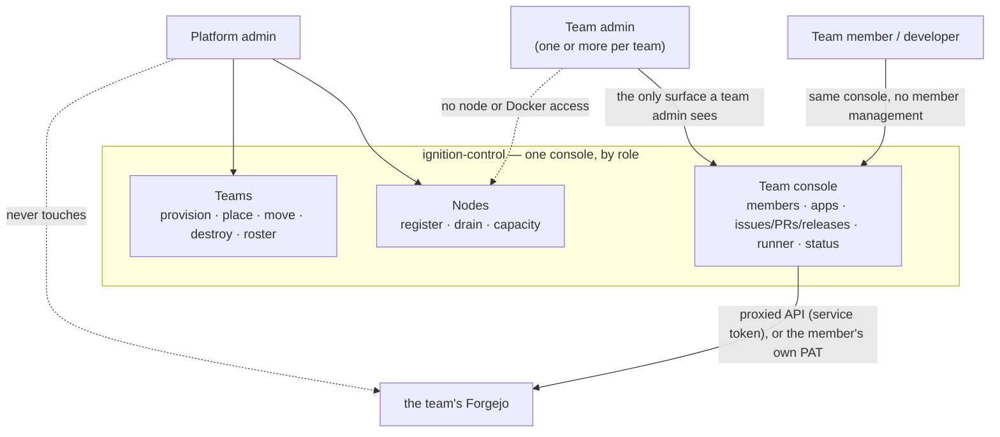
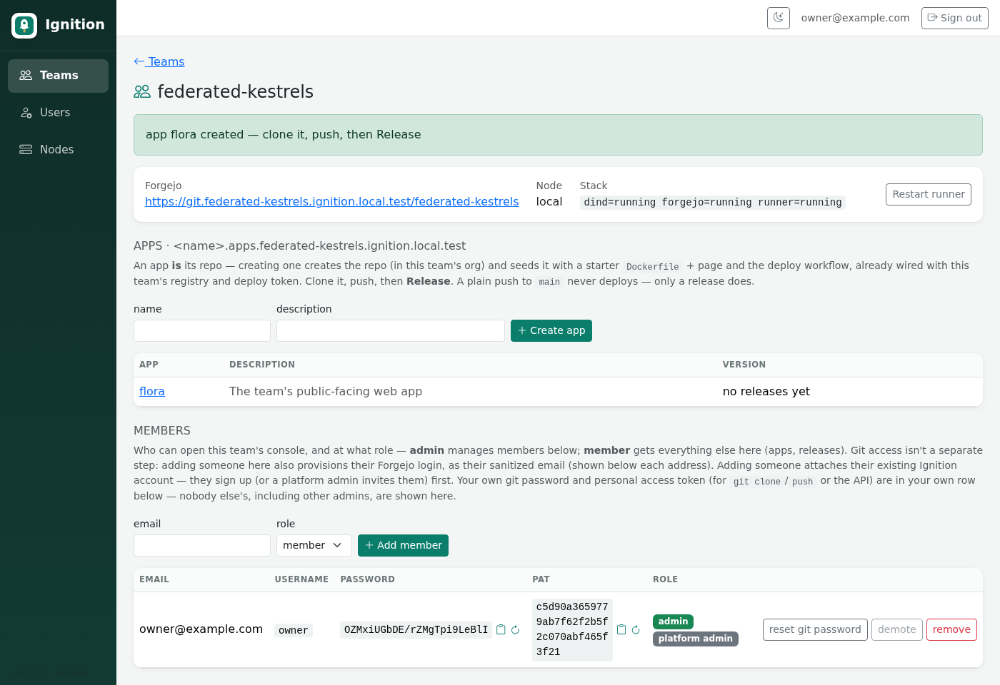
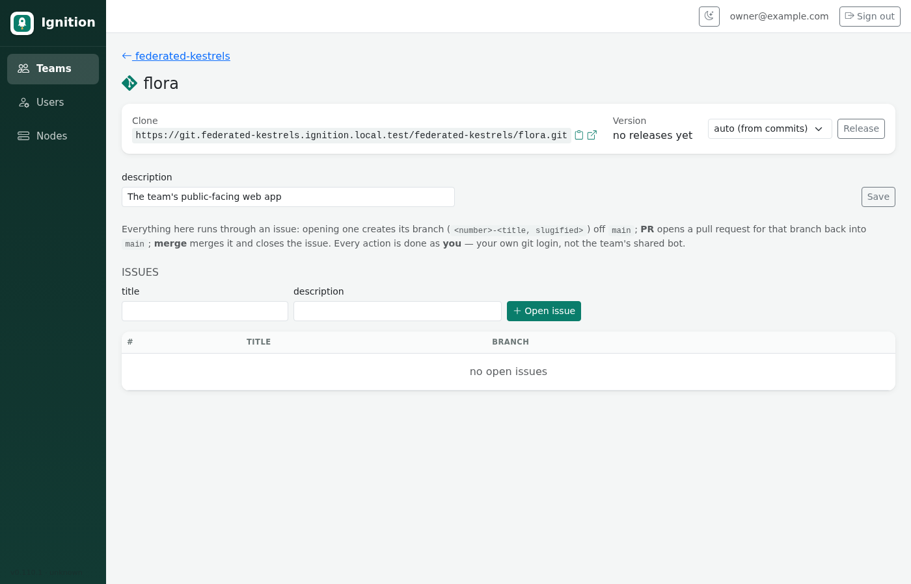
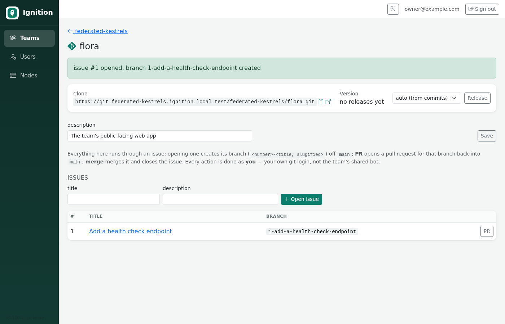
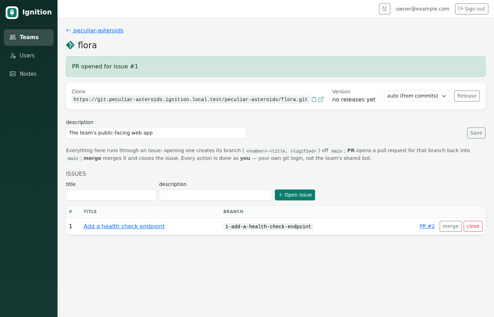
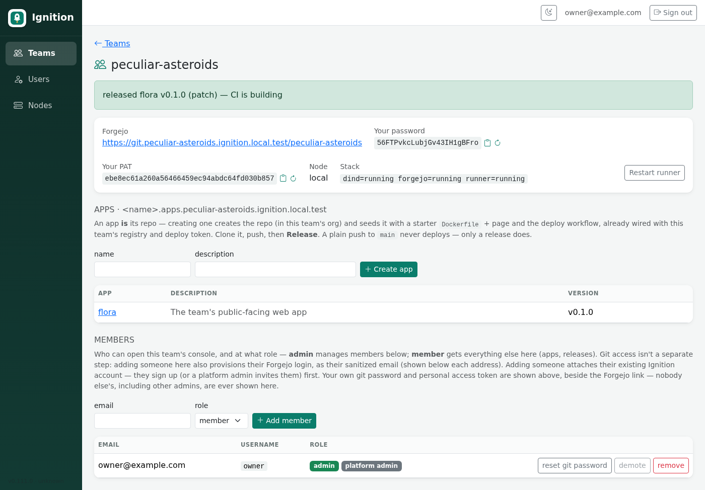

# Roles

Ignition has three roles, one console (`https://<event-domain>/`, email +
password login for everyone — no separate hostname, no token), and a clean
line between what each role can do there.

## Platform admin

The person (or two) running the event. Signs into the **console** at
`https://<event-domain>/` with email + password, same as everyone else — what
they see and can do there is by role (`PLATFORM_ADMIN`), not by a separate
hostname or token. Every task is a console action — there is no CLI.

| Task | In the console |
|---|---|
| Register a host to run teams | **Nodes → Register** — endpoint (`local` / `ssh://…` / `tcp://…`), CPU, memory, optional labels |
| See node capacity / allocation | **Nodes** table (allocated vs. capacity) |
| Stop placing new teams on a node | **Nodes → Drain** (then Undrain) |
| Provision a team | **Provision a team** — a slug; the scheduler places it (or pin a node / label) |
| See every team and its status | **Teams** table |
| Move a team to another node | **Teams → move** (the stack is rebuilt empty; the Forgejo volume doesn't follow) |
| Destroy a team | **Teams → destroy** — the stack **and every app it deployed** |
| Stop a deployed app | **Apps → stop** |
| Bulk provision / teardown an event | **Roster** — paste a slug list |
| Reclaim idle teams now | **Roster → Sweep idle teams now** (also runs on a timer) |

The platform admin **never logs into a team's Forgejo**. Their surface is
nodes and teams.

## Team admin

One or more per team. Signs into the same console, same email + password
as everyone else — what makes them a team admin is the `ZONE_ADMIN:<slug>`
role on that team, not a separate login or hostname. Their console is
`/teams/<slug>` — everything below is a console action there:

| Task | In the console |
|---|---|
| Add / remove team members | **Members** — creates their Forgejo account too, from their email |
| Reset your own git password / PAT | The regenerate icon beside them, on the team console's top card (next to the Forgejo link) — always self-service |
| Reset another member's git password | **Members** — the "reset git password" action (admin only) |
| Create an app (a repo) | **Apps → Create app** — name + description, seeded with a starter Dockerfile + deploy workflow |
| Manage the team's apps | **Apps** — list, description, current version (links to the live app once deployed), stop, delete |
| Restart a stuck Actions runner | **Restart runner** button |

They never touch a Forgejo admin screen; the `ignition-bot` service account
exists only as `ignition-control`'s own credential and never leaves the
controller. A team admin has no node access, no Docker access, no Forgejo
admin access, and no visibility into any other team.

*The team console: your git password and PAT on the top card beside the
Forgejo link, apps (name, description, version), and members. Each secret has
a copy icon and a regenerate icon — nobody else's, including other admins,
are ever shown.*

## Team member / developer

Everyone else on the team — same console, same `/teams/<slug>`, minus member
management. This is the day-to-day surface for actually shipping code; see
**Operating model**, below.

## Operating model — how a team actually works day to day

**Generally, leave Forgejo's own web UI alone.** It's there, and nothing
stops you opening it directly, but day-to-day work — issues, branches, pull
requests, merging, releases — all happens from an app's **management page**
in the console (click the app's name from the team console's Apps table),
not by clicking around in Forgejo. The one thing you still do with a normal
git client is `clone`/`push` — that part is unchanged; it's the
issue/PR/release *lifecycle* that has one intended path.

*An app's management page — the clone URL, the current version, Release, an
editable description, and the issue list. This is where day-to-day work
happens, not in Forgejo's own UI.*

1. **Open an issue** for the work, on the app's management page. This
   automatically creates its branch too — `<issue-number>-<title, slugified>`
   off `main` — so there's no separate "create a branch" step, and every
   branch traces back to the issue that justified it.

   

2. **Clone the repo** (the clone URL and a copy button are right there on the
   management page) and push your commits to that issue's branch, same as any
   git workflow.
3. **Open a PR** — a button on the issue's own row once it has commits to
   merge. It always targets `main` (the only target this project uses); no
   need to pick a base branch.

   

4. **Merge or close** — once Forgejo reports the PR mergeable, **merge**
   closes the issue and deletes the branch automatically. If it turns out
   there's nothing to merge after all, **close** does the same cleanup
   without merging — either way, an issue's branch never outlives the issue,
   and there's no way to reopen a PR for a closed issue (open a new issue
   instead).
5. **Ship a build — a release, from the same management page.** Version
   bumps are automatic, not something anyone picks by hand: click **Release**
   and `ignition-control` reads the commits since the last release, picks the
   bump by [Conventional Commits](https://www.conventionalcommits.org/) (a
   `fix:` → **patch**, a `feat:` → **minor**, a `feat!:`/`BREAKING CHANGE:` →
   **major**; nothing conventional → patch), and tags the next `vX.Y.Z` on
   `main`. The dropdown next to **Release** defaults to *auto (from
   commits)*; override it for that one release if needed.

   

The new tag fires the `build and deploy` workflow; on success the app is live
at `https://<APP_NAME>.apps.<slug>.<event-domain>/` within a minute or two.
**Only a release deploys** — a plain push to `main` does not (and `main` is
protected against direct pushes anyway — every change goes through a PR) —
so every running image carries a version you can redeploy or roll back to.
Re-pushing an image to the **same** tag later (a base-image rebuild, say)
needs no new release: the per-node Watchtower notices the new digest and
rolls the app forward on its own within ~60s.

## The line between the roles

- Platform admin: *which* hosts exist, *where* teams run, *whether* a team
  exists at all.
- Team admin: *who's on* one team and at what role — everything else is the
  same surface every member gets.
- Team member: the operating model above — issues, PRs, releases, all from
  the app's management page, never a Forgejo admin screen.

The control plane (`ignition-control`) is the single process that holds every
credential (platform, per-team service accounts, per-member git logins) and
enforces the split: it authenticates the signed-in session, decides what
role(s) it holds, and only ever acts within that scope.
